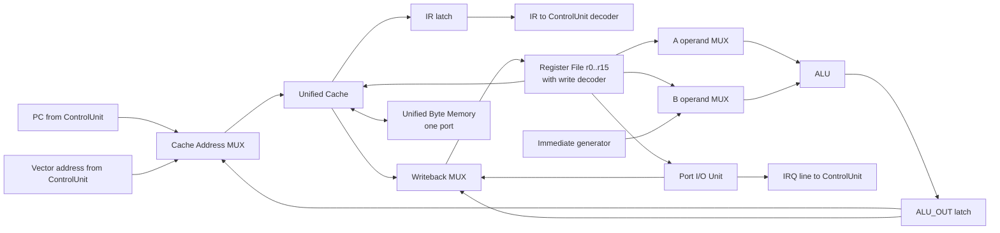
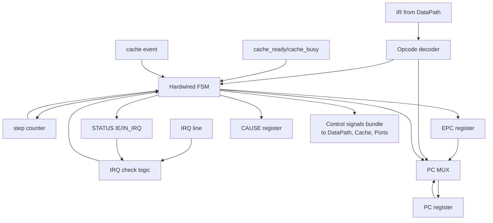
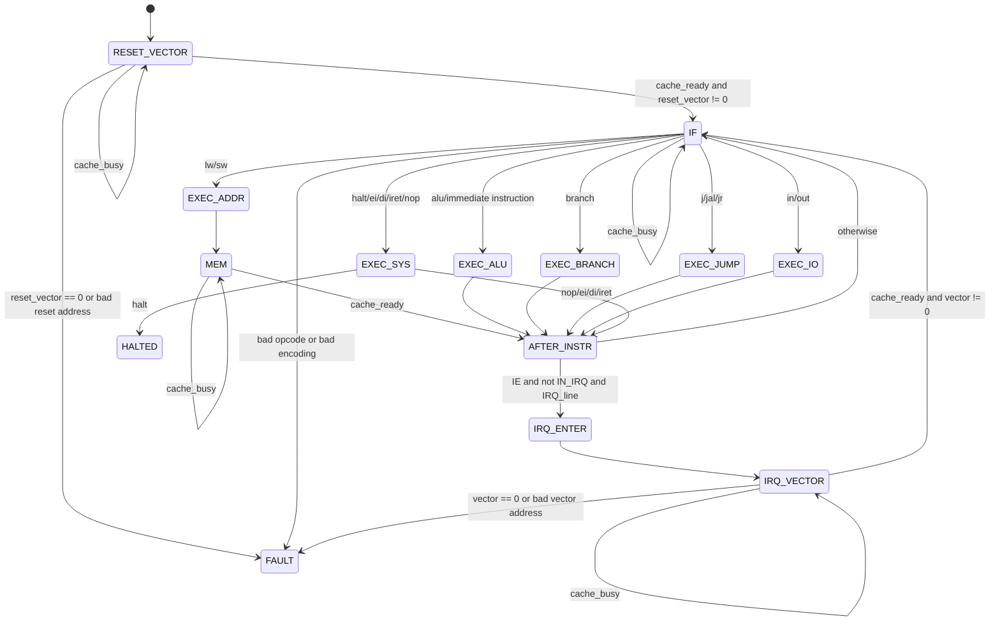

# Лабораторная работа №4. Отчёт

Преподаватель: Пенской Александр Владимирович

Студент: Седов Даниил Борисович

Группа: P3216

Вариант:

```text
asm | risc | neum | hw | tick | binary | trap | port | pstr | prob2 | cache
```

## 0. Соответствие заданию

Отчёт находится в корневом `README.md`, как требует `TASK/lab4-task.md`. Реализация находится в `src/`, чтобы код, примеры и golden-тесты были отделены от отчёта, но сам отчёт оставался единственной точкой проверки.

| Требование отчёта | Где раскрыто |
| ----------------- | ------------ |
| Язык программирования: синтаксис и семантика | раздел 2 |
| Организация памяти: модель памяти, литералы, данные, инструкции, процедуры и прерывания | разделы 3, 4, 12, 13, 14 |
| Система команд: классификация, инструкции, такты и кодирование | разделы 5, 6, 7, 8 |
| Транслятор: CLI, этапы и ошибки | раздел 9 |
| Модель процессора: DataPath, Control Unit, сигналы, такты и журнал | разделы 10, 11 |
| Тестирование и ссылки на golden-тесты | раздел 16 |
| CI, форматирование, lint и типизация | раздел 17 |

---

## 1. Вариант и линия проектирования

Вариант задаёт систему не на одном уровне, а сразу на всей цепочке:

```text
asm source
  -> translator
    -> binary machine code + readable listing
      -> tick-accurate processor model
        -> trace log + output
```

Поэтому архитектура выбирается как связанная цепочка решений, где каждое решение либо прямо следует из пункта варианта, либо поддерживает уже принятое решение на соседнем уровне.

Первое решение следует из `asm`: язык является ассемблером, а не языком высокого уровня. Транслятор не распределяет переменные по регистрам, не строит скрытые временные объекты, не вставляет невидимые runtime-вызовы и не исправляет программу за автора. Программист явно видит регистры, секции, адреса, стек, переходы, обработчик прерывания и размещение данных. Это соответствует требованию к разделу про организацию памяти: должно быть видно, где находятся литералы, константы, переменные, инструкции, процедуры и обработчики.

Второе решение следует из `risc`: процессор является регистровым load-store процессором. Все арифметические и логические операции работают только с регистрами. Память доступна только командами `lw` и `sw`. Ввод-вывод доступен только командами `in` и `out`, потому что вариант дополнительно задаёт `port`. В системе команд нет инструкций, которые одновременно читают память и выполняют арифметику, потому что это было бы уже CISC-поведение.

Третье решение следует из `neum` и актуального требования к памяти: память единая, фон-неймановская, байтово-адресуемая и однопортовая. Инструкции, данные, строки, таблица векторов прерываний, программные буферы и стек находятся в одном адресном пространстве. Адрес — это индекс байта. За один такт через подсистему памяти выполняется только одно обращение: либо чтение, либо запись.

Четвёртое решение следует из `binary`: машинный код хранится в настоящем бинарном файле, а не в текстовом файле с нулями и единицами. Так как `asm` требует секции и `.org`, бинарный файл сделан контейнером сегментов. Сегменты используют байтовые адреса и байтовые размеры, потому что память байтово-адресуемая.

Пятое решение следует из `cache`: все обращения к единой памяти проходят через единый кеш. Кеш находится между процессором и общей памятью. Так как память фон-неймановская, отдельные instruction cache и data cache не вводятся: раздельные кеши потребовали бы дополнительной когерентности кода и данных и ослабили бы прямое соответствие варианту `neum`.

Шестое решение следует из `trap`: входные данные не выдаются программе по факту выполнения команды чтения из заранее готового входного буфера. Вместо этого модель получает расписание входных событий вида `[(tick, symbol), ...]`. В указанный такт устройство ввода делает символ доступным в порте и поднимает прерывание. Получение прерывания и чтение символа из порта — разные события. Обработчик прерывания написан на разрабатываемом asm. У устройства ввода есть один регистр данных, а не скрытая очередь.

Седьмое решение следует из `pstr`: строки в памяти представлены как Pascal string. Первое машинное слово хранит длину, далее каждый символ хранится в отдельном машинном слове. Строковые операции реализуются процедурами или макросами на asm, а не специальным строковым типом процессора.

Восьмое решение следует из `hw` и требований к схемам: Control Unit является hardwired-блоком управления, а не микропрограммным автоматом. DataPath и Control Unit описываются отдельно. DataPath пассивен и выполняет управляющие сигналы. Control Unit активен, хранит `PC`, счётчик шага `step`, состояние автомата и регистры прерываний.

Девятое решение следует из `tick`: модель продвигается ровно на один такт за один шаг главного цикла. Нельзя выполнить инструкцию целиком внутри одной функции и затем просто прибавить число тактов. На каждом такте наблюдаемы все регистры процессора, состояние Control Unit, состояние кеша, линии портов и режим исполнения основной программы или обработчика.

Итоговая система: 32-битный RISC load-store процессор фон-неймановского типа, с байтовой адресацией, однопортовой памятью, единым direct-mapped write-back кешем, hardwired Control Unit, потактовой моделью, port-mapped вводом-выводом и trap-вводом через программный обработчик прерывания.

---

## 2. Язык программирования

### 2.1. Назначение языка

Так как вариант задаёт `asm`, язык описывает машинную программу почти напрямую. Каждая инструкция исходного текста либо кодируется в одну машинную инструкцию, либо является псевдоинструкцией, явно раскрываемой ассемблером до машинного кода.

Язык поддерживает то, что прямо требуется для `asm`:

* метки;
* секции;
* директиву `.org`;
* пользовательские макросы;
* константы;
* условную компиляцию.

Язык не поддерживает то, что противоречило бы роли ассемблера в этой работе:

* автоматическое распределение регистров;
* автоматический spill в память;
* скрытый literal pool;
* линковку нескольких объектных файлов;
* relocatable object format;
* типовую систему высокого уровня;
* heap allocator;
* неявные вызовы runtime-процедур.

Это ограничение важно для защиты работы: отчёт должен показывать отображение программы на память и процессор. Если бы транслятор сам принимал решения о регистрах, размещении временных объектов или создании скрытых данных, связь между исходным текстом и аппаратной моделью стала бы менее проверяемой.

### 2.2. Лексика

Комментарии начинаются с `;` и продолжаются до конца строки.

Идентификаторы чувствительны к регистру. Имена `Loop` и `loop` обозначают разные сущности.

Глобальный идентификатор:

```ebnf
identifier ::= letter { letter | digit | "_" }
```

Локальная метка макроса начинается с `%%` и существует только внутри одного раскрытия макроса.

Целочисленные литералы:

```asm
123          ; decimal
0x7b         ; hexadecimal
0b01111011   ; binary
'a'          ; character literal, value 97
'\n'         ; escaped character
'\x7f'       ; byte escape
```

Символьный литерал имеет значение `0..255`. Значение вне этого диапазона является ошибкой ассемблера, потому что строковый вариант `pstr` хранит символ как байтовый код, помещённый в одно 32-битное машинное слово.

Строковые литералы используются только в директивах данных, прежде всего в `.pstr`. Непосредственная Unicode-семантика не поддерживается. Неэкранированный символ строки должен быть ASCII-символом, а произвольный байт задаётся через `\xNN`.

### 2.3. Синтаксис

```ebnf
program       ::= { line }

line          ::= [ label_def ] [ statement ] [ comment ] newline
label_def     ::= identifier ":"

statement     ::= instruction
                | directive
                | macro_call

instruction   ::= mnemonic [ operand_list ]
operand_list  ::= operand { "," operand }

operand       ::= register
                | expression
                | memory_operand
                | identifier

memory_operand ::= expression "(" register ")"

directive     ::= section_directive
                | org_directive
                | data_directive
                | const_directive
                | macro_directive
                | conditional_directive

section_directive ::= ".section" section_name
section_name       ::= ".vectors" | ".text" | ".rodata" | ".data" | ".bss"

org_directive ::= ".org" expression

data_directive ::= ".word" expression { "," expression }
                 | ".space" expression
                 | ".pstr" string

const_directive ::= ".equ" identifier "," expression

macro_directive ::= ".macro" identifier [ identifier { "," identifier } ] newline
                    { line }
                    ".endm"

conditional_directive ::= ".if" expression newline
                          { line }
                          [ ".else" newline { line } ]
                          ".endif"

macro_call    ::= identifier [ operand_list ]

expression    ::= integer
                | character
                | identifier
                | "(" expression ")"
                | unary_op expression
                | expression binary_op expression

unary_op      ::= "+" | "-" | "~"
binary_op     ::= "+" | "-" | "*" | "/" | "%" | "<<" | ">>" | "&" | "^" | "|"
```

Деление в выражениях ассемблера — целочисленное. Деление на ноль в выражении является ошибкой трансляции.

### 2.4. Семантика программы

До первой директивы `.section` текущей секцией считается `.text`. Это делает минимальную asm-программу короче, но не скрывает размещение: адреса всё равно определяются секциями и `.org`.

Метка обозначает байтовый адрес следующего размещаемого объекта в текущей секции. Если метка стоит перед инструкцией, она обозначает байтовый адрес первого байта 32-битной инструкции. Если метка стоит перед `.word`, она обозначает байтовый адрес первого байта 32-битного слова.

Метка не занимает память.

Директивы не являются инструкциями процессора. Они меняют размещение байтов в бинарном образе или управляют трансляцией.

Константа `.equ` не занимает память. Она подставляется как значение выражения.

```asm
.equ RX_CAP, 128
```

Макросы раскрываются до назначения адресов. Это решение следует из поддержки `.org`, меток и относительных переходов: ассемблер должен видеть окончательный поток инструкций и данных до вычисления байтовых адресов.

Условная компиляция `.if` выполняется до назначения адресов, поэтому условие может использовать только уже известные константы. Использование ещё не определённой метки в `.if` является ошибкой.

### 2.5. Директивы данных и единицы измерения

Так как память байтово-адресуемая, `.org` принимает байтовый адрес.

```asm
.section .text
.org 0x000040
_start:
    nop
```

Директива `.word expr` размещает 32-битное слово, то есть 4 байта. Текущий адрес перед `.word` должен быть кратен 4. Если адрес не выровнен, ассемблер завершает работу с ошибкой. Это нужно, потому что ISA поддерживает только выровненные 32-битные `lw`, `sw` и выборку 32-битных инструкций.

Директива `.space expr` резервирует `expr` байт. В `.bss` эти байты не хранятся в бинарном payload и заполняются нулями загрузчиком. В остальных секциях `.space` создаёт нулевые байты. Если после `.space` размещается `.word`, `.pstr` или инструкция, адрес должен быть снова кратен 4. Ассемблер не добавляет скрытое выравнивание, потому что `asm` должен сохранять явность размещения.

Директива `.pstr "..."` размещает Pascal string как последовательность 32-битных слов: одно слово длины и по одному слову на символ. Поэтому текущий адрес перед `.pstr` должен быть кратен 4.

### 2.6. Макросы

Макрос — текстовая подстановка с параметрами.

```asm
.macro push reg
    addi sp, sp, -4
    sw reg, 0(sp)
.endm
```

Рекурсивные макросы запрещены. Максимальная глубина раскрытия — 32. При превышении глубины ассемблер завершает работу с ошибкой. Ограничение нужно не для архитектуры процессора, а для однозначной остановки транслятора при ошибочном макросе.

Локальные метки внутри макроса записываются с префиксом `%%`.

```asm
.macro dec_until_zero reg
%%loop:
    beq reg, zero, %%end
    addi reg, reg, -1
    j %%loop
%%end:
.endm
```

При каждом раскрытии макроса такие метки получают уникальные внутренние имена. Обычная метка внутри макроса не переименовывается, поэтому повторное раскрытие такого макроса может вызвать ошибку дублирования метки. Это поведение оставлено явным, потому что язык — asm.

### 2.7. Псевдоинструкции

Псевдоинструкции не являются частью ISA. Они раскрываются ассемблером до первого прохода назначения адресов.

| Псевдоинструкция | Раскрытие                                                |
| ---------------- | -------------------------------------------------------- |
| `move rd, rs`    | `add rd, rs, zero`                                       |
| `ret`            | `jr ra`                                                  |
| `call label`     | `jal label`                                              |
| `li rd, imm32`   | одна или две инструкции, в зависимости от значения       |
| `la rd, label`   | загрузка 24-битного байтового адреса через `lui` и `ori` |

`li rd, imm32` работает так:

* если значение помещается в signed 16-bit, используется `addi rd, zero, imm16`;
* если значение помещается в unsigned 16-bit, используется `ori rd, zero, imm16`;
* иначе используется `lui rd, hi16` и `ori rd, rd, lo16`.

`la rd, label` загружает байтовый адрес метки. Если адрес не помещается в 24 бита, ассемблер завершает работу с ошибкой, потому что вся архитектурная память ограничена 24-битными байтовыми адресами.

Ассемблер не заменяет дальний условный переход на пару инструкций. Если смещение `beq`, `bne`, `blt`, `bge`, `bltu` или `bgeu` не помещается в signed 16-bit byte offset, это ошибка трансляции. Такое поведение соответствует `asm`: программист сам выбирает структуру дальнего перехода.

### 2.8. Стиль программ на asm

Демонстрационные программы пишутся в структурном стиле:

* одна нормальная точка завершения через `halt`;
* процедуры возвращаются через `ret`, обработчики прерываний — через `iret`;
* нет нескольких несвязанных `halt` в середине программы;
* все буферы, константы и строки имеют имена;
* критические секции вокруг общей очереди ввода минимальны;
* форматирование исходного asm проверяется тестами.

Это требование связано не с архитектурой процессора, а с проверяемостью работы. По исходному asm должно быть видно намеренную структуру программы, а не набор случайных переходов и аварийных остановок.

---

## 3. Организация памяти и адресация

### 3.1. Машинное слово, байт и порядок байтов

Машинное слово — 32 бита, то есть 4 байта. Это стандартный размер слова, достаточный для демонстрационных алгоритмов и для требования о 64-битной арифметике: 64-битное число представляется парой 32-битных слов.

Память адресуется байтами. Адрес `N` указывает на `N`-й байт памяти.

Архитектурный диапазон байтовых адресов:

```text
0x000000 .. 0xFFFFFF
```

Адрес имеет 24 бита. Это решение связано с форматом команд: при 32-битной фиксированной инструкции и 8-битном opcode абсолютный переход может использовать оставшиеся 24 бита и покрывать всё адресное пространство. Для лабораторных программ, строк, буферов, стека, сортировки и `prob2` 16 MiB байтовой памяти достаточно с большим запасом.

Количество адресуемых байт:

```text
2^24 bytes = 16 MiB
```

Количество выровненных 32-битных слов, которые могут быть адресованы:

```text
2^24 / 4 = 2^22 words
```

Все 32-битные слова в бинарном файле, памяти, листинге и инструкциях записываются big-endian. Например, `.word 0x12345678` занимает байты:

```text
12 34 56 78
```

Выбор big-endian связан с читаемостью листинга: байты машинного слова идут в том же порядке, в котором слово печатается как восьмизначный hex.

### 3.2. Выравнивание

Все инструкции имеют длину 4 байта. Поэтому `PC` всегда должен быть кратен 4.

Все `lw` и `sw` работают только с выровненными 32-битными словами. Эффективный адрес должен быть кратен 4.

Проверки:

| Операция                        | Требование                              |
| ------------------------------- | --------------------------------------- |
| выборка инструкции              | `PC % 4 == 0` и `PC <= 0xFFFFFC`        |
| `lw`                            | `addr % 4 == 0` и `addr <= 0xFFFFFC`    |
| `sw`                            | `addr % 4 == 0` и `addr <= 0xFFFFFC`    |
| `j`, `jal`, `jr`, branch target | target кратен 4 и находится в диапазоне |
| reset vector value              | кратен 4 и не равен `0`                 |
| interrupt vector value          | кратен 4 и не равен `0`                 |

Если адрес вне диапазона или не выровнен, модель останавливается с `FAULT_ADDR`. Отдельный fault для невыровненного доступа не вводится, потому что для этой архитектуры невыровненность является частным случаем некорректного адреса.

### 3.3. Фон-неймановская организация

Из `neum` и требований к памяти следует единая память. В ней находятся:

* таблица векторов;
* машинные инструкции;
* статические данные;
* Pascal strings;
* программные буферы ввода;
* стек;
* данные, созданные программой во время исполнения.

Аппаратного разделения памяти команд и памяти данных нет. Флаги секций в бинарном файле используются загрузчиком, листингом и отладкой, но не создают защиты памяти.

Модель памяти в симуляторе — простой массив байтов. Адрес является индексом в этом массиве. Это прямо следует из требования не усложнять память без необходимости.

Память однопортовая. За один такт выполняется либо чтение, либо запись. Так как процессор работает через кеш, однопортовость проявляется на уровне fill/write-back: кеш не может одновременно читать новую линию и записывать вытесняемую линию.

### 3.4. Карта памяти

Первые 64 байта памяти зарезервированы под таблицу векторов. Это 16 машинных слов по 4 байта.

```text
0x000000 .. 0x000003 : reset vector
0x000004 .. 0x000007 : input interrupt vector
0x000008 .. 0x00003F : reserved vectors, должны быть 0

0x000040              : default .text start
...
.rodata               : after .text, aligned to 4 bytes
.data                 : after .rodata, aligned to 4 bytes
.bss                  : after .data, aligned to 4 bytes
...
0xFFFFFF              : last byte of architectural memory
```

Секции по умолчанию:

| Секция     | Назначение                                       |
| ---------- | ------------------------------------------------ |
| `.vectors` | таблица векторов reset и input interrupt         |
| `.text`    | машинные инструкции и процедуры                  |
| `.rodata`  | статические неизменяемые данные и строки         |
| `.data`    | изменяемые статические данные                    |
| `.bss`     | нулевые данные, не хранящиеся в бинарном payload |

Только `.vectors` и `.text` имеют фиксированные начальные адреса:

```text
.vectors : 0x000000
.text    : 0x000040
```

Остальные секции размещаются последовательно, с выравниванием начала секции на 4 байта. Если программисту нужен конкретный адрес, он использует `.org`.

### 3.5. Таблица векторов

Таблица векторов занимает первые 16 слов памяти.

|       Байтовый адрес | Назначение                |
| -------------------: | ------------------------- |
|           `0x000000` | reset vector              |
|           `0x000004` | input interrupt vector    |
| `0x000008..0x00003F` | reserved, должны быть `0` |

`reset vector` содержит байтовый адрес первой инструкции программы. При сбросе процессор читает 32-битное слово по адресу `0x000000` через кеш и записывает его в `PC`.

`input interrupt vector` содержит байтовый адрес обработчика ввода. При входе в прерывание процессор читает 32-битное слово по адресу `0x000004` через кеш и записывает его в `PC`.

Значение `0` в векторе означает отсутствие обработчика. Это соглашение выбрано потому, что незаполненная память равна нулю, и ошибка незаданного вектора должна быть видна в журнале. Если reset vector равен `0`, модель останавливается с `FAULT_NO_RESET_VECTOR`. Если input interrupt vector равен `0` при активном прерывании, модель останавливается с `FAULT_NO_IRQ_HANDLER`.

Пример:

```asm
.section .vectors
.org 0x000000
.word _start
.word irq_input
.space 56

.section .text
.org 0x000040
_start:
    ; initialization
```

`.space 56` резервирует оставшиеся 14 слов таблицы векторов, то есть `14 * 4` байт.

### 3.6. `.org` и пересечения

`.org expr` устанавливает текущий абсолютный байтовый адрес текущей секции.

```asm
.section .text
.org 0x000100
main:
    nop
```

`.org` может создавать разреженное размещение. Поэтому машинный код хранится не как плоский файл от нулевого адреса до последнего байта, а как бинарный контейнер с сегментами.

Если два размещённых байта попадают в один адрес, ассемблер завершает работу с ошибкой. Перезапись уже размещённого байта не допускается даже если значения совпадают. Это решение следует из требования явно показать отображение программы на память: один байт образа не может иметь два независимых происхождения.

Если `.org` устанавливает адрес, не кратный 4, это само по себе допустимо, потому что память байтово-адресуемая. Но следующая инструкция, `.word` или `.pstr` на таком адресе вызовет ошибку выравнивания на этапе ассемблирования.

### 3.7. Литералы, константы и переменные

Непосредственный литерал кодируется внутри инструкции только если помещается в поле этой инструкции.

```asm
addi a0, zero, 42
```

Если значение не помещается, программист использует `li`, которая раскрывается в обычные инструкции.

```asm
li a0, 0x12345678
```

Ассемблер не создаёт скрытых literal pool. Для `asm` это важно: все статические данные должны быть видимы в исходном коде.

Константа `.equ` не размещается в памяти.

```asm
.equ STACK_INIT, 0x01000000
```

Статическая переменная размещается явно.

```asm
.section .data
counter:
    .word 0
```

Динамические данные размещаются либо на стеке, либо в явно выделенных буферах. Кучи нет, потому что вариант не требует runtime allocator, а asm-программа может явно зарезервировать память через `.space`.

Переменная отображается на регистр только если программист сам выбрал регистр. Если регистров недостаточно, программист сам сохраняет часть значений на стек или в статическую память. Это следует из `asm`: транслятор не выполняет автоматический spill.

### 3.8. Инструкции, процедуры и обработчики

Инструкции обычно размещаются в `.text`. Аппаратно это не enforced: память единая, и выборка инструкции из любого выровненного адреса возможна. Но ассемблер помечает `.text` как `EXEC` в бинарном образе и листинге.

Процедура — это метка в `.text`, вызываемая через `jal` или псевдоинструкцию `call`.

```asm
call puts_pstr
```

Обработчик прерывания — тоже процедура на asm. Отличие не в формате кода, а в способе входа и выхода:

* адрес обработчика лежит в input interrupt vector;
* вход выполняет Control Unit;
* возврат выполняется отдельной инструкцией `iret`, а не `ret`.

Это следует из `trap`: обработчик прерывания должен быть программным, но вход в него является аппаратным событием.

### 3.9. Стек

Стек является соглашением программ, а не отдельным видом памяти. Он находится в той же фон-неймановской памяти.

Стек растёт вниз, к меньшим адресам. Регистр `sp` содержит байтовый адрес следующего свободного слова. Стандартная инициализация:

```asm
.equ STACK_INIT, 0x01000000  ; one past 0xFFFFFF
li sp, STACK_INIT
```

Первый `push` уменьшает `sp` на 4 и записывает слово по адресу `0xFFFFFC`.

```asm
.macro push reg
    addi sp, sp, -4
    sw reg, 0(sp)
.endm

.macro pop reg
    lw reg, 0(sp)
    addi sp, sp, 4
.endm
```

Значение `0x01000000` не является допустимым адресом памяти, но оно допустимо как 32-битное значение регистра. Ошибка возникает только при обращении к памяти по адресу вне диапазона. Поэтому `sp = 0x01000000` корректен как указатель на позицию «сразу за верхом стека».

Аппаратной проверки пересечения стека со статическими данными нет. Если стек перезаписывает данные программы, это обычная запись в память. Если адрес выходит за `0x000000..0xFFFFFF` или становится невыровненным, возникает `FAULT_ADDR`.

Такое поведение следует из `neum`: память единая, а защита памяти не задана вариантом.

### 3.10. Pascal strings

Из `pstr` следует формат строки:

```text
addr + 0  .. addr + 3  : length, 32-bit word
addr + 4  .. addr + 7  : char[0], 32-bit word
addr + 8  .. addr + 11 : char[1], 32-bit word
...
addr + 4n .. addr + 4n+3 : char[n - 1], 32-bit word
```

Пример:

```asm
.section .rodata
msg:
    .pstr "Hi\n"
```

Размещение:

```text
msg + 0  : 0x00000003
msg + 4  : 0x00000048
msg + 8  : 0x00000069
msg + 12 : 0x0000000A
```

Длина — количество символов. Каждый символ хранится в одном 32-битном слове, значение символа находится в диапазоне `0..255`.

Пустая строка допустима и занимает одно слово:

```asm
empty:
    .pstr ""
```

Статические строки разрешены только в `.rodata` и `.data`. Обе секции являются секциями данных: `.rodata` предназначена для неизменяемых данных, `.data` — для изменяемых. Попытка использовать `.pstr` в `.text` является ошибкой ассемблера, потому что требования к `pstr` предписывают хранить статические строки в секции данных.

Максимальная длина строки архитектурно ограничена размером адресного пространства. Ассемблер отвергает `.pstr`, если строка не помещается в память.

---

## 4. Регистры

Процессор имеет 16 регистров общего назначения по 32 бита. Количество 16 выбрано как малый стандартный вариант для учебного RISC: 4-битное поле регистра помещает три регистра в одну 32-битную команду и оставляет место для opcode и immediate-полей.

| Номер | Имя    | Назначение                             |
| ----: | ------ | -------------------------------------- |
|  `r0` | `zero` | всегда `0`, запись игнорируется        |
|  `r1` | `a0`   | аргумент 0, общий регистр              |
|  `r2` | `a1`   | аргумент 1, общий регистр              |
|  `r3` | `a2`   | аргумент 2, общий регистр              |
|  `r4` | `a3`   | аргумент 3, общий регистр              |
|  `r5` | `t0`   | временный регистр                      |
|  `r6` | `t1`   | временный регистр                      |
|  `r7` | `t2`   | временный регистр                      |
|  `r8` | `t3`   | временный регистр                      |
|  `r9` | `t4`   | временный регистр                      |
| `r10` | `t5`   | временный регистр                      |
| `r11` | `rv`   | возвращаемое значение                  |
| `r12` | `k0`   | scratch-регистр обработчика прерывания |
| `r13` | `k1`   | scratch-регистр обработчика прерывания |
| `r14` | `sp`   | указатель стека                        |
| `r15` | `ra`   | адрес возврата                         |

Аппаратно особым является только `zero`: чтение всегда возвращает `0`, запись игнорируется.

`sp`, `ra`, `a0..a3`, `rv`, `k0`, `k1` являются соглашением. Процессор не запрещает использовать их иначе, но стандартные процедуры и обработчик прерывания следуют этому соглашению.

`k0` и `k1` выделены из-за `trap`: при входе в обработчик аппаратно сохраняет только `PC`, `IE` и причину прерывания. Если обработчику нужно сохранить остальные регистры на стек, ему нужны рабочие регистры, которые основная программа не использует.

Побочные эффекты инструкции происходят даже если результат записывается в `zero`. Например:

```asm
in zero, IN_DATA
```

прочитает порт и очистит `READY`, но значение будет отброшено. Это поведение важно для port-mapped I/O: чтение порта является действием, а не только вычислением значения.

---

## 5. Система команд

### 5.1. Общие свойства ISA

Из `risc` следуют свойства ISA:

* каждая инструкция занимает ровно одно 32-битное слово;
* инструкции расположены по байтовым адресам, кратным 4;
* арифметика и логика работают только с регистрами;
* память доступна только через `lw` и `sw`;
* ввод-вывод доступен только через `in` и `out`;
* скрытых флагов `carry`, `zero`, `negative` нет;
* условные переходы сравнивают регистры напрямую.

Отсутствие глобального `carry` означает, что 64-битная арифметика реализуется явно через пары 32-битных слов и инструкции сравнения, например через `sltu` для вычисления переноса.

Все операции над 32-битными словами, кроме деления, выполняются по модулю (2^{32}). Деление на ноль останавливает модель с `FAULT_DIV0`.

### 5.2. Виды адресации

ISA использует только простые виды адресации, соответствующие RISC load-store модели.

| Вид адресации             | Где используется             | Смысл                                         |
| ------------------------- | ---------------------------- | --------------------------------------------- |
| register                  | ALU-инструкции               | операнд находится в регистре                  |
| immediate signed 16-bit   | `addi`, `lw`, `sw`, branch   | непосредственное signed-значение              |
| immediate unsigned 16-bit | `andi`, `ori`, `xori`, `lui` | непосредственное unsigned-значение            |
| base + byte offset        | `lw`, `sw`                   | байтовый адрес = `base + sign_extend(off16)`  |
| PC-relative byte offset   | branch                       | target = адрес следующей инструкции + `off16` |
| absolute byte address     | `j`, `jal`                   | 24-битный байтовый адрес                      |
| port immediate address    | `in`, `out`                  | 16-битный адрес порта                         |

`lw` и `sw` используют byte offset, потому что память байтово-адресуемая. При этом эффективный адрес должен быть кратен 4, так как операции работают с 32-битными словами.

### 5.3. Кодирование инструкций

Все машинные слова в бинарном файле записываются big-endian.

Форматы используют 8-битный opcode. Это упрощает hardwired decode: Control Unit выбирает поведение по одному байту opcode без отдельного поля `funct`. Цена решения — reserved-биты в R-format и Z-format. Это допустимый компромисс для учебного RISC, потому что immediate-, branch-, jump- и port-форматы используют оставшиеся поля эффективно, а reserved-биты в R/Z проверяются декодером и превращают случайный мусор в `FAULT_BAD_ENCODING`.

#### R-format

```text
31          24 23  20 19  16 15  12 11             0
+-------------+------+------+------+----------------+
| opcode      | rd   | rs1  | rs2  | reserved = 0   |
+-------------+------+------+------+----------------+
```

Используется для регистровых операций.

#### I-format

```text
31          24 23  20 19  16 15                   0
+-------------+------+------+----------------------+
| opcode      | rd   | rs1  | imm16                |
+-------------+------+------+----------------------+
```

Используется для immediate-операций и адресации памяти.

Для `sw` поле `rd` трактуется как регистр-источник `rs`.

Для `lui` поле `rs1` должно быть `0`, иначе возникает `FAULT_BAD_ENCODING`.

#### B-format

```text
31          24 23  20 19  16 15                   0
+-------------+------+------+----------------------+
| opcode      | rs1  | rs2  | off16                |
+-------------+------+------+----------------------+
```

`off16` — signed-смещение в байтах относительно адреса следующей инструкции.

```text
off16 = target - (branch_address + 4)
```

Диапазон:

```text
-32768 .. 32767 bytes
```

Так как инструкции выровнены на 4 байта, корректный branch target должен быть кратен 4. Ассемблер отвергает branch, если target не выровнен или смещение не помещается в signed 16-bit.

#### J-format

```text
31          24 23                                  0
+-------------+-------------------------------------+
| opcode      | addr24                              |
+-------------+-------------------------------------+
```

`addr24` — абсолютный байтовый адрес в диапазоне `0x000000..0xFFFFFF`.

Для `j` и `jal` адрес должен быть кратен 4. Ассемблер проверяет это для меток. Если сырое машинное слово содержит невыровненный адрес, модель останавливается с `FAULT_ADDR` при выполнении перехода.

#### P-format

```text
31          24 23  20 19  16 15                   0
+-------------+------+-----+-----------------------+
| opcode      | reg  | 0   | port16                |
+-------------+------+-----+-----------------------+
```

Используется для port-mapped I/O. Поле `reg` является `rd` для `in` и `rs` для `out`. Поле `19..16` должно быть нулём.

#### Z-format

```text
31          24 23                                  0
+-------------+-------------------------------------+
| opcode      | reserved = 0                        |
+-------------+-------------------------------------+
```

Используется для инструкций без операндов.

Если reserved-биты в любом формате не равны нулю, декодер останавливает модель с `FAULT_BAD_ENCODING`.

### 5.4. Набор инструкций

Базовые такты указаны для случая, когда выборка инструкции и все обращения к памяти попадают в кеш. Если происходит промах кеша, соответствующая стадия cache access длится 41 или 81 такт вместо 1.

| Opcode | Инструкция             | Формат | Базовые такты | Семантика                                        |
| -----: | ---------------------- | ------ | ------------: | ------------------------------------------------ |
| `0x00` | `nop`                  | Z      |             2 | нет действия                                     |
| `0x01` | `add rd, rs1, rs2`     | R      |             2 | `rd = rs1 + rs2 mod 2^32`                        |
| `0x02` | `sub rd, rs1, rs2`     | R      |             2 | `rd = rs1 - rs2 mod 2^32`                        |
| `0x03` | `mul rd, rs1, rs2`     | R      |             2 | младшие 32 бита unsigned-произведения            |
| `0x04` | `mulhu rd, rs1, rs2`   | R      |             2 | старшие 32 бита unsigned-произведения            |
| `0x05` | `divu rd, rs1, rs2`    | R      |             2 | unsigned-деление                                 |
| `0x06` | `remu rd, rs1, rs2`    | R      |             2 | unsigned-остаток                                 |
| `0x07` | `and rd, rs1, rs2`     | R      |             2 | bitwise and                                      |
| `0x08` | `or rd, rs1, rs2`      | R      |             2 | bitwise or                                       |
| `0x09` | `xor rd, rs1, rs2`     | R      |             2 | bitwise xor                                      |
| `0x0A` | `sll rd, rs1, rs2`     | R      |             2 | `rd = rs1 << (rs2 & 31)`                         |
| `0x0B` | `srl rd, rs1, rs2`     | R      |             2 | logical right shift by `rs2 & 31`                |
| `0x0C` | `sra rd, rs1, rs2`     | R      |             2 | arithmetic right shift by `rs2 & 31`             |
| `0x0D` | `slt rd, rs1, rs2`     | R      |             2 | signed `<`, результат `0` или `1`                |
| `0x0E` | `sltu rd, rs1, rs2`    | R      |             2 | unsigned `<`, результат `0` или `1`              |
| `0x10` | `addi rd, rs1, imm16`  | I      |             2 | `rd = rs1 + sign_extend(imm16)`                  |
| `0x11` | `andi rd, rs1, imm16`  | I      |             2 | `rd = rs1 & zero_extend(imm16)`                  |
| `0x12` | `ori rd, rs1, imm16`   | I      |             2 | `rd = rs1 \| zero_extend(imm16)`                 |
| `0x13` | `xori rd, rs1, imm16`  | I      |             2 | `rd = rs1 ^ zero_extend(imm16)`                  |
| `0x14` | `lui rd, imm16`        | I      |             2 | `rd = imm16 << 16`, `rs1` должен быть `0`        |
| `0x20` | `lw rd, off16(base)`   | I      |             3 | чтение 32-битного слова из памяти через кеш      |
| `0x21` | `sw rs, off16(base)`   | I      |             3 | запись 32-битного слова в память через кеш       |
| `0x30` | `beq rs1, rs2, label`  | B      |             2 | переход, если `rs1 == rs2`                       |
| `0x31` | `bne rs1, rs2, label`  | B      |             2 | переход, если `rs1 != rs2`                       |
| `0x32` | `blt rs1, rs2, label`  | B      |             2 | signed `<`                                       |
| `0x33` | `bge rs1, rs2, label`  | B      |             2 | signed `>=`                                      |
| `0x34` | `bltu rs1, rs2, label` | B      |             2 | unsigned `<`                                     |
| `0x35` | `bgeu rs1, rs2, label` | B      |             2 | unsigned `>=`                                    |
| `0x40` | `j label`              | J      |             2 | абсолютный переход                               |
| `0x41` | `jal label`            | J      |             2 | `ra = address_of_jal + 4`, затем `PC = label`    |
| `0x42` | `jr rs`                | R      |             2 | `PC = rs`; `rd` и `rs2` должны быть `0`          |
| `0x43` | `halt`                 | Z      |             2 | остановка модели с `HALT`                        |
| `0x50` | `in rd, port`          | P      |             2 | чтение из порта                                  |
| `0x51` | `out port, rs`         | P      |             2 | запись в порт                                    |
| `0x60` | `ei`                   | Z      |             2 | включить прерывания после завершения инструкции  |
| `0x61` | `di`                   | Z      |             2 | выключить прерывания после завершения инструкции |
| `0x62` | `iret`                 | Z      |             2 | возврат из обработчика                           |

Во время исполнения после стадии `IF` регистр `PC` уже указывает на следующую инструкцию. Поэтому на уровне Control Unit `jal` записывает в `ra` текущее значение `PC`, а на уровне ISA это равно `address_of_jal + 4`.

Для `lw` и `sw` адрес вычисляется так:

```text
addr32 = (base + sign_extend(off16)) mod 2^32
```

Затем `addr32` проверяется как байтовый адрес выровненного 32-битного слова. Если `addr32 > 0xFFFFFC` или `addr32 % 4 != 0`, возникает `FAULT_ADDR`.

Для branch target:

```text
target32 = (address_of_branch + 4 + sign_extend(off16)) mod 2^32
```

Если `target32 > 0xFFFFFC` или `target32 % 4 != 0`, возникает `FAULT_ADDR`.

### 5.5. Что ISA не делает

ISA не содержит byte load/store, потому что вариант `pstr` допускает хранение одного символа в одном машинном слове, а демонстрационные алгоритмы работают со словами. Байтовая адресация при этом сохраняется: адреса являются байтовыми, инструкции занимают 4 байта, смещения `lw/sw` измеряются в байтах, сегменты бинарного файла задаются байтовыми адресами и размерами.

ISA не содержит системных вызовов. Ввод-вывод реализуется портами, а обработчик ввода — обычным asm-кодом.

ISA не содержит аппаратных строковых инструкций. Это запрещено смыслом `pstr`: работа со строками должна быть реализована процедурами или макросами на разрабатываемом языке.

ISA не содержит скрытых флагов состояния ALU. Это поддерживает RISC-свойство: зависимости между инструкциями видны через регистры.

---

## 6. Ввод-вывод и прерывания

### 6.1. Почему ввод отделён от получения данных

Из `trap` следует, что входной символ становится доступен не потому, что программа выполнила инструкцию чтения, а потому, что устройство ввода получило внешний токен по расписанию и подняло прерывание.

Поэтому в системе различаются два события:

```text
interrupt request  ; устройство сообщает, что состояние изменилось
in rd, IN_DATA     ; программа реально читает символ из порта
```

Это разделение обязательно: требования прямо запрещают смешивать вызов прерывания и получение данных.

### 6.2. Карта портов

Так как вариант задаёт `port`, ввод-вывод не отображается в память. Для него есть отдельное адресное пространство портов и отдельные инструкции.

Порт имеет 16-битный адрес.

|     Порт | Имя          | Доступ | Назначение                  |
| -------: | ------------ | ------ | --------------------------- |
| `0x0000` | `IN_STATUS`  | read   | состояние устройства ввода  |
| `0x0001` | `IN_DATA`    | read   | текущий входной символ      |
| `0x0002` | `IN_CTRL`    | write  | очистка EOF и overrun       |
| `0x0010` | `OUT_STATUS` | read   | состояние устройства вывода |
| `0x0011` | `OUT_DATA`   | write  | вывод одного символа        |

`IN_STATUS`:

|     Бит | Имя       | Значение                       |
| ------: | --------- | ------------------------------ |
|     `0` | `READY`   | в `IN_DATA` лежит символ       |
|     `1` | `EOF`     | входной поток завершён         |
|     `2` | `OVERRUN` | символ был потерян устройством |
| `3..31` | reserved  | всегда `0`                     |

`IN_CTRL`:

| Бит | Действие           |
| --: | ------------------ |
| `0` | очистить `EOF`     |
| `1` | очистить `OVERRUN` |

Запись других битов в `IN_CTRL` игнорируется. Это поведение выбрано как обычное для простого управляющего порта: устройство реагирует только на известные управляющие биты.

`OUT_STATUS` всегда возвращает `1`. Устройство вывода в этой модели всегда готово, потому что задание требует показать итоговый буфер вывода, но не требует моделировать медленный дисплей или UART.

Запись в `OUT_DATA` добавляет в выходной буфер один символ со значением:

```text
rs & 0xFF
```

Чтение неизвестного порта, запись в неизвестный порт, запись в read-only порт или чтение из write-only порта останавливает модель с `FAULT_BAD_PORT`.

### 6.3. Расписание входа

Файл входа для модели содержит расписание событий:

```text
10  '1'
20  '0'
30  '0'
40  '\n'
50  EOF
```

Число — номер такта. Событие применяется в начале указанного такта, до перехода Control Unit на этом такте. Это нужно для потактовой проверяемости: в журнале видно, что устройство изменило состояние на конкретном такте, а процессор смог отреагировать только тогда, когда схема физически позволяет.

Требования к расписанию:

* номера тактов неотрицательные;
* номера тактов строго возрастают;
* после `EOF` не должно быть других событий;
* в один такт не может быть двух входных событий.

Если расписание нарушает эти правила, модель не запускает программу и сообщает ошибку входного файла. Это проще и честнее, чем вводить скрытую очередь событий, запрещённую требованиями к `trap`.

Если `EOF` отсутствует, входной поток считается незавершённым. Тогда программа должна завершиться по своей логике или модель остановится по лимиту тактов.

### 6.4. Устройство ввода

Устройство ввода содержит только:

```text
data_register : 8-bit value
READY         : 1 bit
EOF           : 1 bit
OVERRUN       : 1 bit
```

Аппаратной очереди нет.

Если приходит символ и `READY = 0`, устройство записывает символ в `data_register`, выставляет `READY = 1` и поднимает IRQ.

Если приходит символ и `READY = 1`, новый символ теряется, а `OVERRUN` становится `1`. Старый символ остаётся в `data_register`.

Если приходит `EOF`, устройство выставляет `EOF = 1` и поднимает IRQ. EOF не является символом и не читается через `IN_DATA`.

Чтение `IN_DATA`:

* если `READY = 1`, возвращает `data_register` и очищает `READY`;
* если `READY = 0`, возвращает `0` и не меняет состояние устройства.

IRQ является level-triggered. Линия IRQ активна, пока выполняется хотя бы одно условие:

```text
READY = 1
EOF = 1
OVERRUN = 1
```

Если обработчик не прочитал символ и не очистил состояние устройства, после `iret` процессор снова войдёт в обработчик. Это намеренное поведение: прерывание подтверждается действиями программы, а не самим фактом входа в обработчик.

### 6.5. Специальные регистры прерываний

Control Unit имеет внутренние регистры:

| Регистр  | Назначение                   |
| -------- | ---------------------------- |
| `EPC`    | адрес возврата из прерывания |
| `CAUSE`  | причина прерывания           |
| `STATUS` | биты состояния прерываний    |

`STATUS`:

|     Бит | Имя      | Значение                          |
| ------: | -------- | --------------------------------- |
|     `0` | `IE`     | global interrupt enable           |
|     `1` | `IN_IRQ` | процессор находится в обработчике |
| `2..31` | reserved |                                   |

После reset:

```text
IE = 0
IN_IRQ = 0
```

Это решение связано с trap-вводом: программа должна успеть инициализировать стек, программный буфер ввода и другие данные до первого обработчика. Внешние события, пришедшие до `ei`, остаются в устройстве ввода, если для них есть место. Если до чтения первого символа приходит второй символ, устройство фиксирует `OVERRUN`, а не создаёт скрытую очередь.

### 6.6. Вход в прерывание

Наличие IRQ проверяется каждый такт и записывается в журнал. Но вход в обработчик выполняется только на границе инструкции. Это соответствует требованию precise interrupts: инструкция либо полностью завершена, либо ещё не начата.

Условие входа:

```text
IE = 1
IN_IRQ = 0
IRQ_line = 1
```

Последовательность входа:

```text
EPC = PC
CAUSE = 1              ; input interrupt
IE = 0
IN_IRQ = 1
handler = memory[0x000004] через кеш
PC = handler
```

Если `handler = 0`, возникает `FAULT_NO_IRQ_HANDLER`.

Чтение вектора идёт через тот же кеш, что и все остальные обращения к памяти. Это следует из `neum + cache`: таблица векторов находится в общей памяти.

Если событие ввода пришло во время выборки инструкции, выполнения `lw`, ожидания кеша или портовой операции, обработчик начнёт выполняться только после завершения текущей инструкции. Пока процессор ждёт кеш, устройство ввода продолжает принимать события по расписанию. Если входные события идут быстрее, чем программа физически может их прочитать, устройство теряет данные и выставляет `OVERRUN`.

### 6.7. Прерывание во время обработчика

Вложенные прерывания не поддерживаются. Во время обработчика:

```text
IN_IRQ = 1
IE = 0
```

Если новый символ приходит во время обработчика:

* если `READY = 0`, символ сохраняется в `data_register`;
* если `READY = 1`, новый символ теряется и выставляется `OVERRUN`.

После `iret`:

```text
PC = EPC
IE = 1
IN_IRQ = 0
```

Если линия IRQ всё ещё активна, процессор снова войдёт в обработчик до выборки следующей инструкции основной программы.

Это решение реалистично для простой системы: вложенных обработчиков нет, но pending-состояние устройства сохраняется.

### 6.8. Программная очередь ввода

Аппаратной очереди нет, но программа может создать очередь в памяти. Это важно для `cat`, потому что вход потенциально бесконечный, и основной код должен отделять быстрый обработчик прерывания от логики обработки ввода.

Стандартный runtime использует кольцевой буфер в `.data` или `.bss`:

```text
rx_head   : индекс чтения, word
rx_tail   : индекс записи, word
rx_count  : количество символов, word
rx_flags  : флаги, word
rx_buf    : RX_CAP слов, по одному слову на символ
```

`rx_flags`:

| Бит | Значение       |
| --: | -------------- |
| `0` | eof_seen       |
| `1` | device_overrun |
| `2` | ring_overflow  |

`RX_CAP` — программная константа. Для golden-тестов используется `128`, потому что этого достаточно для тестовых строк, но это не аппаратный предел.

Обработчик ввода:

1. читает `IN_STATUS`;
2. если `OVERRUN = 1`, выставляет `device_overrun` и очищает `OVERRUN` через `IN_CTRL`;
3. если `READY = 1`, читает `IN_DATA`;
4. если кольцевой буфер не полон, кладёт символ в `rx_buf`;
5. если буфер полон, выставляет `ring_overflow` и отбрасывает символ;
6. если `EOF = 1`, выставляет `eof_seen` и очищает `EOF` через `IN_CTRL`;
7. завершает `iret`.

Основная программа читает из кольцевого буфера через короткие критические секции:

```asm
di
; проверить rx_count, прочитать символ, обновить rx_head/rx_count
ei
```

Это необходимо, потому что обработчик и основной код изменяют одни и те же слова памяти. Без `di/ei` возможна потеря обновления `rx_count`.

Если во время такой критической секции приходит внешний символ, устройство ввода удержит его до `ei`, если `READY` был равен `0`. Если до освобождения устройства придёт ещё один символ, возникнет аппаратный `OVERRUN`. Поэтому критические секции в runtime короткие.

---

## 7. Кеш

### 7.1. Почему кеш единый

Память фон-неймановская и однопортовая, поэтому кеш один. Через него проходят:

* чтение reset vector;
* выборка инструкции;
* чтение и запись данных через `lw/sw`;
* чтение таблицы векторов прерываний.

Порты ввода-вывода не кешируются, потому что вариант задаёт `port`, а не memory-mapped I/O.

### 7.2. Параметры кеша

Используется direct-mapped cache:

```text
line size      : 4 words = 16 bytes
line count     : 16
capacity       : 64 words = 256 bytes
hit latency    : 1 tick
memory latency : 10 ticks per 32-bit word access
write policy   : write-back
miss policy    : write-allocate
```

Direct-mapped cache выбран как базовый общепринятый вариант кеша: его достаточно, чтобы показать попадания, промахи и конфликтные промахи, но он не добавляет сложность set-associative замещения.

Размер линии 4 слова выбран, чтобы в тестах была видна пространственная локальность: после промаха на первом слове следующие три последовательных слова могут читаться с hit.

16 линий выбраны как малый размер, при котором журнал остаётся читаемым, а конфликтные промахи легко демонстрируются адресами с шагом:

```text
line_size * line_count = 16 bytes * 16 = 256 bytes
```

Кеш работает с байтовыми адресами, но все CPU-доступы к кешу являются выровненными 32-битными word-доступами. Поэтому разбиение адреса такое:

```text
byte_offset_in_word = address % 4          ; должен быть 0 для CPU-доступа
word_offset         = (address / 4) % 4
index               = (address / 16) % 16
tag                 = address / 256
line_base           = address & 0xFFFFF0
```

Каждая строка кеша хранит:

```text
valid : 1 bit
dirty : 1 bit
tag
data[4] : 4 words
```

### 7.3. Такты кеша

Любой доступ к кешу начинается с проверки tag, которая занимает 1 такт.

Hit:

```text
1 tick
```

Clean miss:

```text
1 tick    ; проверка tag
4 * 10    ; загрузка 4 слов из памяти
= 41 ticks
```

Dirty miss:

```text
1 tick    ; проверка tag
4 * 10    ; write-back старой линии
4 * 10    ; загрузка новой линии
= 81 ticks
```

Во время промаха Control Unit остаётся в текущем cache-access состоянии. Ожидание не сжимается в одну операцию и не моделируется как `ticks += 41` или `ticks += 81`: каждый такт проверки, write-back и fill является отдельным вызовом `tick()` и отдельной строкой журнала. Устройство ввода при этом продолжает принимать события по расписанию, но прерывание будет обработано только после завершения текущей инструкции.

### 7.4. Чтение и запись

Read hit:

```text
вернуть data[word_offset]
```

Read miss:

```text
если вытесняемая линия dirty:
    записать 4 слова в память, по одному слову за memory transaction
загрузить новую линию из памяти, по одному слову за memory transaction
вернуть data[word_offset]
```

Write hit:

```text
data[word_offset] = value
dirty = 1
```

Write miss:

```text
если вытесняемая линия dirty:
    записать 4 слова в память
загрузить новую линию из памяти
data[word_offset] = value
dirty = 1
```

Незаполненные адреса памяти читаются как `0`. Если кеш загружает линию, часть которой не представлена в бинарном образе, отсутствующие байты становятся нулями. При чтении 32-битного слова эти байты собираются в слово big-endian.

### 7.5. Самомодифицирующийся код

Самомодифицирующийся код аппаратно не запрещён. Это следует из `neum`: код и данные находятся в одной памяти.

Так как кеш единый, отдельной проблемы когерентности instruction cache и data cache нет. Если программа записала слово, а затем перешла на этот адрес, выборка инструкции пойдёт через тот же кеш и увидит актуальное слово.

Тесты не обязаны использовать самомодифицирующийся код. Он разрешён как следствие архитектуры, а не как цель системы.

### 7.6. Что кеш не делает

Кеш не реализует:

* separate instruction/data cache;
* prefetch;
* branch prediction;
* set-associative replacement;
* write-through режим;
* многопроцессорную когерентность.

Эти механизмы не требуются вариантом `cache`. Для лабораторной работы нужен наблюдаемый кеш с попаданиями, промахами, write-back и ожиданием процессора, а не промышленная подсистема памяти.

---

## 8. Бинарное представление машинного кода

### 8.1. Почему используется контейнер сегментов

Вариант задаёт `binary`, значит машинный код должен быть настоящим бинарным файлом, а не текстом из `0` и `1`.

Одновременно `asm` требует секции и `.org`. Программа может разместить байт по высокому адресу, не заполняя всё пространство до него. Поэтому плоский бинарный файл был бы либо огромным, либо неоднозначным. Используется бинарный контейнер с сегментами.

Так как память байтово-адресуемая, сегменты используют байтовые адреса и байтовые размеры.

### 8.2. Формат файла

Все многобайтные числа записываются big-endian.

```text
Header:
    magic          4 bytes    "L4MC"
    version        u16        1
    segment_count  u16

Segment:
    base_address   u32
    byte_count     u32
    flags          u32
    bytes          byte_count bytes, если flags.BSS = 0
```

`base_address` должен быть в диапазоне:

```text
0x000000 .. 0xFFFFFF
```

Для непустого сегмента должно выполняться:

```text
base_address + byte_count - 1 <= 0xFFFFFF
```

`flags`:

| Бит | Имя     | Значение                                              |
| --: | ------- | ----------------------------------------------------- |
| `0` | `EXEC`  | сегмент содержит инструкции                           |
| `1` | `WRITE` | сегмент предполагается изменяемым                     |
| `2` | `BSS`   | payload отсутствует, загрузчик заполняет байты нулями |

Флаги не являются аппаратной защитой. Они нужны для загрузчика, debug dump и читаемости отчёта. Запись в `.text` аппаратно возможна, потому что защита памяти не задана вариантом.

Сегменты не могут пересекаться по байтам. Пересечение является ошибкой ассемблера и ошибкой загрузчика.

### 8.3. Загрузка бинарного образа

Загрузчик создаёт байтовую память размером `2^24` байт, заполненную нулями. Затем он применяет сегменты по порядку:

* если `BSS = 0`, payload копируется в память начиная с `base_address`;
* если `BSS = 1`, диапазон сегмента заполняется нулями, payload в файле отсутствует;
* если сегмент выходит за пределы памяти, загрузчик завершает работу с ошибкой;
* если сегменты пересекаются, загрузчик завершает работу с ошибкой.

После загрузки процессор не начинает исполнение с фиксированного адреса `.text`. Он читает reset vector по адресу `0x000000` через кеш. Это сохраняет единое правило: даже начальный `PC` берётся из фон-неймановской памяти.

### 8.4. Отладочный листинг

Из `binary` также следует текстовый debug dump.

Формат:

```text
<address> - <HEXCODE> - <mnemonic>
```

Дополнительно ассемблер может добавить исходную позицию после мнемоники, но обязательная часть остаётся ровно такой:

```text
000040 - 0x10100064 - addi a0, zero, 100
000044 - 0x41000080 - jal 0x000080
000080 - 0x50010001 - in a0, 0x0001
```

Для слов данных mnemonic заменяется директивой:

```text
000200 - 0x00000005 - .word 5
```

Ассемблер также создаёт source map. Если source map передан модели, журнал тактов показывает исходную строку. Если source map не передан, журнал показывает только адрес, hex-код и дизассемблированную инструкцию.

---

## 9. Транслятор

### 9.1. Интерфейс

```bash
asm.py <source.asm> <target.bin> \
    --debug <target.hex> \
    --map <target.map.json>
```

Обязательные аргументы:

```text
source.asm   исходная программа
target.bin   бинарный образ
```

Дополнительные файлы:

```text
target.hex       человекочитаемый листинг
target.map.json  source map для журнала модели
```

Транслятор является консольным приложением. Это соответствует требованиям к разделу «Транслятор»: входом являются имя файла исходного кода и имя файла машинного кода, выходом — файл машинного кода.

### 9.2. Этапы трансляции

Ассемблер работает в два прохода после препроцессинга. Два прохода — стандартный подход для asm, потому что метка может использоваться до определения.

Последовательность:

1. Лексический разбор строк.
2. Обработка `.equ`, `.macro`, `.if/.else/.endif`.
3. Раскрытие макросов и псевдоинструкций.
4. Разбор директив и инструкций.
5. Первый проход:

   * ведение location counter для каждой секции;
   * применение `.org`;
   * назначение байтовых адресов меткам;
   * обнаружение пересечений байтов;
   * проверка выравнивания инструкций и слов.
6. Второй проход:

   * вычисление выражений;
   * проверка диапазонов;
   * кодирование инструкций;
   * формирование байтовых сегментов.
7. Запись `target.bin`, `target.hex`, `target.map.json`.

Псевдоинструкции раскрываются до первого прохода, потому что они меняют количество машинных слов и, следовательно, байтовые адреса последующих меток.

### 9.3. Правила кодирования адресов

Все адреса меток являются байтовыми.

Для `j` и `jal` ассемблер записывает в `addr24` байтовый адрес метки.

Для branch ассемблер вычисляет signed byte offset:

```text
off16 = target - (branch_address + 4)
```

Для `lw` и `sw` смещение в синтаксисе `off16(base)` тоже измеряется в байтах. Например:

```asm
lw t0, 8(a0)
```

читает третье 32-битное слово объекта, если `a0` указывает на начало объекта.

### 9.4. Ошибки трансляции

Ассемблер завершает работу с ошибкой в случаях:

* неизвестная инструкция;
* неизвестная директива;
* неизвестный идентификатор;
* дублирующаяся метка;
* дублирующаяся константа;
* деление на ноль в выражении;
* значение не помещается в поле инструкции;
* branch target не помещается в signed 16-bit byte offset;
* branch target не выровнен на 4 байта;
* jump target не помещается в 24-bit byte address;
* jump target не выровнен на 4 байта;
* `.org` или секции создают пересечение байтов;
* инструкция размещается по адресу, не кратному 4;
* `.word` размещается по адресу, не кратному 4;
* `.pstr` размещается по адресу, не кратному 4;
* `.pstr` используется вне `.rodata` или `.data`;
* строковый символ вне диапазона `0..255`;
* `.space` получает отрицательное значение;
* макрос раскрывается глубже 32 уровней;
* `.if` использует значение, неизвестное препроцессору;
* сегмент выходит за диапазон `0x000000..0xFFFFFF`.

Ассемблер не обязан восстанавливаться после ошибки и продолжать трансляцию. Это согласуется с примечанием задания о непроизводственном характере компилятора.

---

## 10. Модель процессора

### 10.1. Интерфейс

```bash
machine.py <program.bin> <input.schedule> \
    --map <program.map.json> \
    --log <trace.log> \
    --max-ticks 1000000
```

Вход:

```text
program.bin      бинарный образ
input.schedule   расписание входных событий
```

Выход:

```text
stdout           символы, записанные в OUT_DATA
trace.log        потактовый журнал
stop reason      причина остановки
```

Если достигнут `--max-ticks`, модель останавливается с `STOP_TICK_LIMIT`. Это не считается успешным завершением программы.

### 10.2. Структура модели и потактовость

Модель разделяется на два основных элемента:

```text
ControlUnit
DataPath
```

DataPath пассивен. Он не решает, какую инструкцию исполнять, когда входить в прерывание и какой следующий `PC` выбрать. Он только выполняет управляющие сигналы: защёлкнуть регистр, выбрать вход мультиплексора, выполнить ALU-операцию, обратиться к кешу, прочитать или записать порт.

Control Unit активен. Он хранит:

* `PC`;
* `EPC`;
* `CAUSE`;
* `STATUS`;
* состояние FSM;
* счётчик шага `step`;
* декодированную информацию о текущей инструкции.

Такое разделение следует из требований к модели процессора: DataPath и Control Unit должны быть отдельными, а потактовость должна обеспечиваться счётчиком шага внутри Control Unit.

Главный цикл модели продвигает систему ровно на один такт за один вызов `tick()`.

Антипаттерн, который не используется:

```text
execute_instruction()
    выполнить всю инструкцию
    ticks += N
```

Такой подход запрещён, потому что состояние видно только на границах инструкций. В этой модели на каждом такте наблюдаемы:

* все регистры общего назначения;
* `IR`;
* `ALU_OUT`;
* `PC`;
* `EPC`;
* `CAUSE`;
* `STATUS`;
* состояние кеша;
* состояние устройства ввода;
* pending IRQ;
* текущие `state` и `step` Control Unit.

Если состояние ждёт кеш, `state` и `step` не перескакивают сразу к концу ожидания. Каждый такт ожидания — отдельный шаг модели и отдельная строка журнала.

### 10.3. DataPath

DataPath построен на мультиплексорах, защёлках, регистровом файле, ALU, кеш-интерфейсе и портовом устройстве. Арифметика внутри ALU не детализируется: сложение, вычитание, умножение, деление, сдвиги и сравнения считаются выполняемыми за один такт, как разрешено требованиями к схемам.

`PC` не находится в DataPath. Он находится в Control Unit. На DataPath поступает только значение `PC` как один из возможных источников адреса для кеша.



Основные элементы DataPath:

| Элемент               | Назначение                                              |
| --------------------- | ------------------------------------------------------- |
| `IR`                  | защёлкнутое 32-битное слово текущей инструкции          |
| `Register File`       | 16 регистров общего назначения                          |
| `Register decoder`    | выбирает один регистр для записи                        |
| `Immediate generator` | комбинационно строит sign/zero-extended immediate       |
| `ALU`                 | арифметика, логика, сравнения, вычисление адресов       |
| `ALU_OUT`             | промежуточная защёлка результата ALU для memory access  |
| `Writeback MUX`       | выбирает источник записи в регистр                      |
| `Cache Address MUX`   | выбирает адрес кеша: `PC`, vector address или `ALU_OUT` |
| `Unified Cache`       | общий кеш инструкций, данных и векторов                 |
| `Unified Byte Memory` | единая байтовая однопортовая память                     |
| `Port I/O Unit`       | отдельное адресное пространство портов                  |

`ALU_OUT` нужен для согласованности со схемой: `lw` и `sw` не выполняют вычисление адреса и доступ к памяти как read-modify-write за один такт. Сначала адрес защёлкивается в `ALU_OUT`, затем следующий такт использует его для обращения к кешу.

### 10.4. Методы DataPath как сигналы схемы

В коде DataPath методы соответствуют управляющим сигналам. Это делает связь «схема ↔ модель» проверяемой: метод должен отражать элемент или действие на структурной схеме, а не скрывать декодирование инструкции.

Примеры методов:

```text
latch_ir(value)
latch_alu_out(value)
write_register(reg, value)
read_register(reg)
select_address_source(src)
cache_read(address)
cache_write(address, value)
port_read(port)
port_write(port, value)
alu_execute(op, lhs, rhs)
```

DataPath не знает, что такое `addi`, `jal` или `iret`. Он знает только операции уровня схемы. Декодирование opcode и выбор последовательности сигналов — ответственность Control Unit.

### 10.5. Control Unit

Control Unit является hardwired FSM. Памяти микрокода нет, потому что вариант задаёт `hw`.



Основные управляющие сигналы:

| Сигнал           | Назначение                                                                |
| ---------------- | ------------------------------------------------------------------------- |
| `ir_we`          | защёлкнуть слово из кеша в `IR`                                           |
| `rf_we`          | разрешить запись в регистровый файл                                       |
| `rf_dst`         | номер регистра назначения                                                 |
| `wb_src`         | источник writeback: ALU, cache, port, PC                                  |
| `alu_op`         | операция ALU                                                              |
| `alu_a_src`      | источник первого операнда ALU                                             |
| `alu_b_src`      | источник второго операнда ALU                                             |
| `alu_out_we`     | защёлкнуть результат ALU в `ALU_OUT`                                      |
| `cache_req`      | запрос к кешу                                                             |
| `cache_we`       | режим кеша: read или write                                                |
| `cache_addr_src` | источник адреса кеша: `PC`, vector address, `ALU_OUT`                     |
| `pc_we`          | разрешить запись `PC`                                                     |
| `pc_src`         | источник нового `PC`: `PC + 4`, branch target, jump target, `EPC`, vector |
| `port_rd`        | чтение порта                                                              |
| `port_wr`        | запись порта                                                              |
| `status_we`      | изменение `IE` или `IN_IRQ`                                               |
| `epc_we`         | запись `EPC`                                                              |
| `cause_we`       | запись `CAUSE`                                                            |

Управляющие линии на схеме показываются пучком, а не полной разводкой ко всем элементам. Это сделано для читаемости схемы и соответствует требованию не превращать схему в мешанину линий.

### 10.6. Состояния Control Unit

Декодирование является комбинационной частью между выборкой и исполнением, отдельного такта `DECODE` нет. Это поддерживает базовую длительность RISC-инструкции в 2 такта при cache hit: один такт на выборку, один такт на выполнение.



`AFTER_INSTR` не является отдельным тактом. Это логическая точка в конце такта исполнения инструкции. В ней проверяется возможность входа в прерывание и выбирается следующее состояние.

`step` хранит номер такта внутри текущего состояния или внутри повторяющегося cache-access состояния. Для обычных состояний `step` равен `0` на входе в состояние и сбрасывается при переходе в следующее состояние. Для состояний ожидания кеша `step` увеличивается каждый такт, пока кеш не выставит `cache_ready`.

Главный цикл модели всегда делает ровно один tick:

```text
while not halted and not fault:
    machine.tick()
```

`machine.tick()` не исполняет инструкцию целиком. Он выполняет один переход Control Unit и один такт работы кеша или портов. После этого управление возвращается вызывающему коду, и состояние можно вывести в журнал или остановить модель.

### 10.7. Тактовая модель

Один tick соответствует одному переходу FSM или одному такту ожидания кеша.

На каждом такте порядок действий такой:

1. Устройство ввода применяет событие расписания с текущим номером такта, если оно есть.
2. Линия IRQ пересчитывается и становится наблюдаемой в журнале.
3. Control Unit выполняет действие текущего состояния.
4. DataPath выполняет поданные управляющие сигналы.
5. Кеш выполняет один такт своей операции, если состояние обращается к памяти.
6. В конце такта защёлкиваются новые значения регистров.
7. В журнал записывается полное состояние.
8. Номер такта увеличивается на 1.

Базовые последовательности при cache hit:

```text
ALU instruction:
    IF        1 tick  ; cache -> IR, PC <- PC + 4
    EXEC_ALU 1 tick  ; RF/imm -> ALU -> RF
    total     2 ticks

lw:
    IF        1 tick  ; cache -> IR, PC <- PC + 4
    EXEC_ADDR 1 tick  ; RF + sign_extend(off16) -> ALU_OUT
    MEM       1 tick  ; cache[ALU_OUT] -> RF
    total     3 ticks

sw:
    IF        1 tick  ; cache -> IR, PC <- PC + 4
    EXEC_ADDR 1 tick  ; RF + sign_extend(off16) -> ALU_OUT
    MEM       1 tick  ; RF -> cache[ALU_OUT]
    total     3 ticks

in/out:
    IF       1 tick
    EXEC_IO  1 tick
    total    2 ticks

branch:
    IF          1 tick
    EXEC_BRANCH 1 tick
    total       2 ticks

jump/jal/jr:
    IF        1 tick
    EXEC_JUMP 1 tick
    total     2 ticks

system:
    IF       1 tick
    EXEC_SYS 1 tick
    total    2 ticks

interrupt entry:
    IRQ_ENTER  1 tick
    IRQ_VECTOR 1 tick if vector cache hit
    total      2 ticks if vector cache hit
```

Если cache access промахивается, соответствующее состояние длится 41 или 81 такт вместо 1. Эти такты не агрегируются: clean miss даёт 41 отдельный такт и 41 строку журнала для этого доступа, dirty miss даёт 81 отдельный такт и 81 строку журнала.

Reset выполняется через чтение `memory[0x000000]` через кеш. При пустом кеше reset vector вызывает clean miss и занимает 41 такт. Это не исключение из правила кеша: таблица векторов находится в общей памяти.

### 10.8. Precise interrupts

Прерывание проверяется каждый такт как наблюдаемое состояние линии IRQ, но вход в обработчик разрешён только в конце инструкции.

Если входной символ приходит во время `MEM`-стадии `lw`, `lw` сначала завершится, и только после этого процессор войдёт в обработчик. Если за время ожидания кеша устройство потеряет следующий символ, это будет отражено в `OVERRUN`.

Такое поведение важно для защиты от неясных состояний: обработчик всегда видит согласованное состояние регистров и памяти после завершённой инструкции.

### 10.9. Журнал

Каждый такт записывается в журнал.

Минимальные поля:

```text
tick
step
mode: RESET | MAIN | IRQ | HALTED | FAULT
state
PC
IR
decoded instruction
source location, если есть source map
registers r0..r15
EPC, CAUSE, STATUS
cache event
port event
IRQ line
input device state
output buffer length
```

Пример строки исполнения:

```text
T=000184 step=0 mode=MAIN state=EXEC_IO pc=000044 ir=0x51100011 out OUT_DATA value='A'
```

Пример строки ожидания кеша:

```text
T=000231 step=17 mode=MAIN state=MEM pc=000058 cache=MISS addr=000240 index=04 tag=0002 phase=FILL
```

Журнал не сжимает несколько тактов ожидания кеша в одну запись. Если промах занимает 41 такт, в журнале есть 41 тактовая запись для этого доступа. Запись вида «CACHE MISS, ticks += 41» не подходит, потому что она скрывает состояние регистров внутри инструкции и не позволяет проверить входные события, пришедшие во время ожидания.

Пример входа в обработчик:

```text
T=000300 step=0 mode=IRQ state=IRQ_ENTER epc=00006C cause=INPUT status=IE:0 IN_IRQ:1
```

Из журнала однозначно видно, исполняется основная программа или обработчик. Это прямое требование `trap`.

В журнале также видно, что символ не может появиться в выводе раньше физически возможного такта: сначала событие входа делает порт готовым, затем процессор на границе инструкции входит в обработчик, затем обработчик читает порт и кладёт символ в программный буфер, затем основная программа извлекает символ и выполняет `out`.

### 10.10. Причины остановки

Успешная остановка:

| Причина | Значение                   |
| ------- | -------------------------- |
| `HALT`  | программа выполнила `halt` |

Ошибочные остановки:

| Причина                 | Когда возникает                                                              |
| ----------------------- | ---------------------------------------------------------------------------- |
| `FAULT_NO_RESET_VECTOR` | reset vector равен `0`                                                       |
| `FAULT_NO_IRQ_HANDLER`  | input interrupt vector равен `0`                                             |
| `FAULT_BAD_OPCODE`      | неизвестный opcode                                                           |
| `FAULT_BAD_ENCODING`    | reserved-биты не равны нулю или формат нарушен                               |
| `FAULT_ADDR`            | адрес памяти вне диапазона, невыровненный word-доступ или невыровненный `PC` |
| `FAULT_BAD_PORT`        | неверный порт или неверное направление доступа                               |
| `FAULT_DIV0`            | `divu` или `remu` с делителем `0`                                            |
| `STOP_TICK_LIMIT`       | достигнут лимит тактов                                                       |

После `HALT` модель не обязана сбрасывать dirty-линии кеша в память. Наблюдаемым результатом программы считается вывод через `OUT_DATA` и журнал. Это согласуется с вариантом, где результат алгоритма должен быть подан на вывод.

---

## 11. Схемы и методология проверки схем

### 11.1. Раздельные схемы

DataPath и Control Unit рисуются отдельными схемами.

Схемы включены в отчёт ниже как изображения; исходники draw.io лежат рядом с `README.md`, без отдельной директории документации:


Рис. 1. DataPath: регистровый файл, MUX-ы операндов и адреса, ALU, `IR`, `ALU_OUT`, единый кеш, единая память и портовый ввод-вывод.


Рис. 2. Control Unit: hardwired FSM, `PC`, `EPC`, `CAUSE`, `STATUS`, `step`, декодер opcode, выбор источника `PC`, обработка cache-ready и precise interrupt entry.

Draw.io-исходники схем: [`datapath.drawio`](datapath.drawio) и [`control_unit.drawio`](control_unit.drawio).

Объединённая схема всего CPU не используется как основная, потому что она быстро становится нечитаемой: на ней смешиваются линии данных, управляющие сигналы, память, кеш, порты и регистры управления. Раздельные схемы позволяют проверить две разные вещи:

* по DataPath видно, куда могут идти значения;
* по Control Unit видно, почему на каждом такте выбираются именно такие сигналы.

Это следует из требований к схемам: схема должна быть читаемой, помещаться на экран и позволять разобрать любую инструкцию по тактам.

### 11.2. Элементная база схем

Схемы строятся на:

* мультиплексорах;
* защёлках;
* регистровом файле с decoder записи;
* ALU как недетализированном функциональном блоке;
* блоке кеша;
* блоке единой памяти;
* блоке портового ввода-вывода.

Схемы не используют:

* демультиплексоры;
* отдельные логические вентили;
* детальную схему сумматора, умножителя или делителя внутри ALU;
* дублированные адресные входы памяти;
* отдельные instruction/data тракты памяти.

Такое ограничение выбрано не для упрощения отчёта, а для соответствия уровню Verilog/VHDL-описания: схема должна описывать регистры, мультиплексоры и блоки, а не транзисторный уровень.

### 11.3. Разбор инструкции по схеме

Для каждой инструкции можно пройти один общий маршрут:

1. `PC` из Control Unit подаётся на address mux DataPath.
2. Unified cache читает слово инструкции.
3. В такте `IF` слово защёлкивается в `IR`, а `PC` защёлкивает `PC + 4`.
4. Control Unit комбинационно декодирует `IR`.
5. По opcode выбирается состояние исполнения.
6. DataPath выполняет ровно те сигналы, которые соответствуют состоянию и `step`.
7. В конце инструкции проверяется pending IRQ.
8. Если IRQ активен и разрешён, Control Unit переходит к `IRQ_ENTER`.

Пример для `lw a0, 0(sp)`:

```text
IF          PC -> addr mux -> cache read -> IR, PC <- PC + 4
EXEC_ADDR   RF[sp] + sign_extend(0) -> ALU_OUT
MEM         ALU_OUT -> addr mux -> cache read -> RF[a0]
AFTER_INSTR проверить IRQ
```

Пример для `jal foo`:

```text
IF          PC -> addr mux -> cache read -> IR, PC <- PC + 4
EXEC_JUMP   RF[ra] <- PC, PC <- addr24
AFTER_INSTR проверить IRQ
```

После `IF` регистр `PC` уже указывает на следующую инструкцию, поэтому значение, записанное в `ra`, равно адресу возврата `address_of_jal + 4`.

Пример для `iret`:

```text
IF          PC -> addr mux -> cache read -> IR, PC <- PC + 4
EXEC_SYS    PC <- EPC, STATUS.IE <- 1, STATUS.IN_IRQ <- 0
AFTER_INSTR если IRQ всё ещё активен, снова войти в IRQ_ENTER
```

Если чтение инструкции, данных или вектора попадает в cache miss, соответствующий `IF`, `MEM` или `IRQ_VECTOR` не исчезает в одной строке. Состояние остаётся тем же, `step` увеличивается, а журнал показывает все такты ожидания.

### 11.4. Связь схемы и кода

Порядок реализации:

1. Нарисовать DataPath и Control Unit.
2. По схемам вручную проиграть все классы инструкций.
3. Из схем вывести `state`, `step` и сигналы.
4. Реализовать DataPath как пассивный набор методов-сигналов.
5. Реализовать Control Unit как активный FSM.
6. Сверить журнал с ручным разбором инструкций.
7. Только после этого добавить кеш как блок между процессором и памятью.

Кеш реализуется поверх уже работающего ядра, но в финальной архитектуре он является обязательной частью DataPath и схемы. Это разделение относится только к порядку разработки, а не к финальной модели.

---

## 12. Соглашение о вызовах

Соглашение о вызовах не является аппаратной частью ISA. Оно нужно, чтобы стандартные процедуры строк, ввода и арифметики были совместимы.

| Регистр    | Роль                                    |
| ---------- | --------------------------------------- |
| `a0..a3`   | аргументы                               |
| `rv`       | возвращаемое значение                   |
| `t0..t5`   | временные регистры вызывающего          |
| `sp`       | указатель стека                         |
| `ra`       | адрес возврата                          |
| `k0`, `k1` | scratch-регистры обработчика прерывания |

Вызывающая сторона сохраняет временные регистры, если они нужны после вызова.

Процедура, которая использует `ra` для вложенного вызова, сохраняет `ra` на стек.

Обработчик прерывания обязан сохранить все регистры, которые он изменяет, кроме `k0` и `k1`. Это правило следует из trap-модели: обработчик может прервать основную программу между любыми двумя инструкциями, и основная программа не должна видеть испорченные регистры.

Стековые операции используют байтовые адреса и шаг 4 байта на слово.

```asm
.macro push reg
    addi sp, sp, -4
    sw reg, 0(sp)
.endm

.macro pop reg
    lw reg, 0(sp)
    addi sp, sp, 4
.endm
```

Если процедура принимает адрес строки, этот адрес является байтовым адресом первого слова Pascal string.

---

## 13. Стандартные процедуры

Эти процедуры не являются частью процессора. Они реализуются на asm и нужны для тестовых алгоритмов.

| Процедура                  | Назначение                                       |
| -------------------------- | ------------------------------------------------ |
| `put_char(ch)`             | вывести младший байт `ch` через `OUT_DATA`       |
| `puts_pstr(addr)`          | вывести Pascal string                            |
| `rx_pop()`                 | достать символ из программного кольцевого буфера |
| `read_line_pstr(dst, cap)` | собрать строку до `\n` или `EOF`                 |
| `parse_u32_pstr(addr)`     | разобрать unsigned decimal из pstr               |
| `print_u32(value)`         | вывести unsigned 32-bit decimal                  |
| `print_u64(hi, lo)`        | вывести unsigned 64-bit decimal                  |
| `u64_add`                  | сложение 64-битных чисел                         |
| `u64_sub`                  | вычитание 64-битных чисел                        |
| `u32_mul_u64`              | умножение `u32 * u32 -> u64` через `mul/mulhu`   |
| `sort_u32`                 | сортировка массива 32-битных чисел               |

`puts_pstr` читает длину из `addr + 0` и выводит ровно столько символов из слов:

```text
addr + 4
addr + 8
...
addr + 4 * length
```

Нулевой символ внутри строки выводится как обычный символ и не завершает строку. Это следует из `pstr`: завершителем является длина, а не `\0`.

`read_line_pstr(dst, cap)` записывает стандартную Pascal string:

```text
dst + 0 : length
dst + 4 : char[0]
dst + 8 : char[1]
...
```

`cap` измеряется в символах, не в байтах. Так как каждый символ занимает одно машинное слово, буфер для строки capacity `cap` должен иметь размер:

```text
4 * (cap + 1) bytes
```

Если строка длиннее `cap`, процедура выставляет ошибку ввода. Символы сверх capacity отбрасываются до конца строки или EOF.

`print_u64(hi, lo)` реализуется программно. ISA не содержит 64-битного деления, поэтому процедура десятичной печати использует программное деление пары слов на 10 или другой простой алгоритм, явно работающий с переносами. Это нужно для демонстрации арифметики двойной точности при 32-битном слове.

---

## 14. Программный ввод и runtime-буфер

### 14.1. Почему буфер программный

Требования к `trap` запрещают магические очереди в устройстве ввода. Но программы `cat`, `hello_user_name`, `sort` и `prob2` должны уметь обрабатывать входные данные не только прямо внутри обработчика. Поэтому очередь делается обычной структурой данных в памяти программы.

Это согласует два уровня:

* аппаратный уровень имеет один регистр `IN_DATA`;
* программный уровень может создать кольцевой буфер в `.data` или `.bss`.

Если программа не успевает читать из устройства, аппаратный `OVERRUN` фиксирует потерю данных. Если программа успевает читать устройство, но не успевает обрабатывать уже принятые символы, может переполниться программный кольцевой буфер и выставиться `ring_overflow`.

### 14.2. Формат кольцевого буфера

```text
rx_head   : byte address B + 0
rx_tail   : byte address B + 4
rx_count  : byte address B + 8
rx_flags  : byte address B + 12
rx_buf[0] : byte address B + 16
rx_buf[1] : byte address B + 20
...
```

Все поля — 32-битные слова.

`rx_head` и `rx_tail` хранят индексы элементов, а не байтовые адреса. Индекс находится в диапазоне:

```text
0 .. RX_CAP - 1
```

Адрес элемента вычисляется так:

```text
rx_buf_addr + 4 * index
```

`rx_count` находится в диапазоне:

```text
0 .. RX_CAP
```

Если `rx_count = RX_CAP`, буфер полон.

Если `rx_count = 0`, буфер пуст.

### 14.3. Поведение обработчика

Обработчик использует `k0` и `k1` как scratch-регистры. Если ему нужны дополнительные регистры, он сохраняет их на стек.

Обработчик не выполняет сложный разбор входа. Он только переносит байт из аппаратного порта в программный буфер и фиксирует флаги. Это важно для физически правдоподобного тайминга: обработчик должен быть коротким, иначе частый ввод будет приводить к `OVERRUN`.

Порядок обработки статуса:

```text
status = in IN_STATUS

if status.OVERRUN:
    rx_flags.device_overrun = 1
    out IN_CTRL, CLEAR_OVERRUN

if status.READY:
    ch = in IN_DATA
    if rx_count < RX_CAP:
        rx_buf[rx_tail] = ch
        rx_tail = (rx_tail + 1) mod RX_CAP
        rx_count = rx_count + 1
    else:
        rx_flags.ring_overflow = 1

if status.EOF:
    rx_flags.eof_seen = 1
    out IN_CTRL, CLEAR_EOF

iret
```

Если одновременно выставлены `READY` и `EOF`, обработчик сначала читает символ, затем фиксирует EOF. Это позволяет корректно обработать последний символ перед концом входа.

### 14.4. Поведение основной программы

Основная программа вызывает `rx_pop()`.

`rx_pop()`:

* на короткое время выполняет `di`;
* проверяет `rx_count`;
* если символ есть, читает его из `rx_buf[rx_head]`;
* обновляет `rx_head` и `rx_count`;
* выполняет `ei`;
* возвращает символ или признак пустого буфера.

Критическая секция нужна только вокруг слов, которые изменяют и обработчик, и основная программа. Парсер, сортировка и печать не выполняются при выключенных прерываниях.

Если `rx_flags.device_overrun = 1` или `rx_flags.ring_overflow = 1`, программы, для которых потеря входа недопустима, выводят `ERR_INPUT\n`.

---

## 15. Алгоритм `prob2`

`prob2` соответствует Euler problem 6: найти разность между квадратом суммы первых `n` натуральных чисел и суммой их квадратов.

Вход подаётся через trap-ввод. Программа читает одну строку из программного буфера, который наполняется обработчиком прерывания.

Формат входа:

```text
[0-9]+ '\n'
```

Также допускается `EOF` сразу после цифр вместо `'\n'`.

Пробелы, знак `+`, знак `-`, пустая строка и любые нецифровые символы являются ошибкой ввода.

Формат вывода:

```text
<answer>\n
```

Для ошибки ввода:

```text
ERR_INPUT\n
```

Для выхода за диапазон:

```text
ERR_RANGE\n
```

### 15.1. Диапазон

Программа принимает:

```text
0 <= n <= 92681
```

Граница выбрана из требования продемонстрировать 64-битную арифметику поверх 32-битного машинного слова и при этом не выходить за unsigned 64-bit.

Для `n = 92681`:

```text
answer = 18446160229542257100
```

Это значение помещается в `2^64 - 1`.

Для `n = 92682` результат уже больше `2^64 - 1`, поэтому программа выводит:

```text
ERR_RANGE\n
```

Если десятичное значение при разборе не помещается в unsigned 32-bit, программа выводит `ERR_INPUT\n`, потому что входной парсер работает с `u32`.

### 15.2. Формула

Используется стандартная формула:

[
\text{square_of_sum} = \left(\frac{n(n+1)}{2}\right)^2
]

[
\text{sum_of_squares} = \frac{n(n+1)(2n+1)}{6}
]

[
\text{answer} = \text{square_of_sum} - \text{sum_of_squares}
]

Вычисления выполняются в unsigned 64-bit, представленном парой слов:

```text
hi : старшие 32 бита
lo : младшие 32 бита
```

Деление на `2` и `3` выполняется до умножения, выбирая множитель, который делится без остатка. Это уменьшает промежуточные значения и делает вычисления достаточными без общей 64-битной инструкции деления.

### 15.3. Связь алгоритма с архитектурой

`prob2` специально не получает вход как аргумент командной строки модели. Вход приходит через расписание `trap`, потому что требование к алгоритму говорит подавать входные данные через ввод, а вариант задаёт `trap`.

Результат не проверяется через память. Программа печатает результат через `OUT_DATA`, потому что требование к алгоритму говорит подавать результат на вывод.

64-битное значение не хранится в одном регистре. Оно хранится в паре 32-битных регистров или слов памяти, потому что машинное слово — 32 бита. Переносы и заёмы вычисляются явно через `sltu`, а не через скрытый флаг `carry`.

---

## 16. Тестирование

Golden-тесты находятся в `src/golden/` и являются самодостаточными YAML-сценариями. Обязательные алгоритмы и сценарии варианта покрыты отдельными файлами:

* [`hello.yml`](src/golden/hello.yml) — `hello world`, `.pstr`, `.rodata`, `OUT_DATA`;
* [`cat.yml`](src/golden/cat.yml) — потенциально бесконечный trap-ввод через программную очередь;
* [`hello_user_name.yml`](src/golden/hello_user_name.yml) и [`hello_user_name_long.yml`](src/golden/hello_user_name_long.yml) — prompt, чтение имени, Pascal string, переполнение буфера;
* [`sort.yml`](src/golden/sort.yml) и [`sort_invalid_token.yml`](src/golden/sort_invalid_token.yml) — массивы, парсер чисел, сортировка и ошибка формата;
* [`double_precision.yml`](src/golden/double_precision.yml) — 64-битная арифметика на 32-битных словах;
* [`prob2_100.yml`](src/golden/prob2_100.yml), [`prob2_range.yml`](src/golden/prob2_range.yml), [`prob2_max.yml`](src/golden/prob2_max.yml), [`prob2_invalid.yml`](src/golden/prob2_invalid.yml) — алгоритм варианта и границы диапазона;
* [`cache_sequential.yml`](src/golden/cache_sequential.yml) и [`cache_conflict_writeback.yml`](src/golden/cache_conflict_writeback.yml) — hit/miss, conflict и write-back;
* [`trap_irq.yml`](src/golden/trap_irq.yml) — вход в обработчик прерывания;
* [`tick_lw.yml`](src/golden/tick_lw.yml) — потактовость `IF/EXEC_ADDR/MEM`;
* [`branch_byte_offset.yml`](src/golden/branch_byte_offset.yml), [`assembler_unaligned_org.yml`](src/golden/assembler_unaligned_org.yml), [`fault_unaligned_lw.yml`](src/golden/fault_unaligned_lw.yml), [`fault_bad_encoding.yml`](src/golden/fault_bad_encoding.yml) — байтовая адресация, выравнивание и faults.

Тесты оформляются как golden tests. Это не рекомендация, а обязательная форма интеграционного тестирования для работы.

Один тест — один самодостаточный YAML-файл. Разнесение одного теста по нескольким файлам не используется, потому что требования прямо запрещают такой формат как неудобный для проверки.

Каждый YAML содержит:

```yaml
in_source: |
  ; asm source

in_input_schedule: |
  10 'f'
  20 'o'
  30 'o'
  40 '\n'
  50 EOF

in_args:
  max_ticks: 1000000

out_code_base64: |
  ...

out_listing: |
  000040 - 0x... - ...

out_stdout: |
  ...

out_stop_reason: HALT

out_log: |
  ...
```

`out_log` может быть репрезентативным фрагментом, если полный журнал слишком большой. Но фрагмент должен быть достаточным для проверки того, что важно в конкретном тесте: потактовость, кеш, прерывания, порты, переходы, результат и причина остановки.

### 16.1. `hello`

Цель: проверить `.pstr`, `.rodata`, `puts_pstr`, `OUT_DATA`, бинарный листинг и базовую выборку инструкций через кеш.

Строка:

```asm
.section .rodata
msg:
    .pstr "hello world\n"
```

Ожидаемый вывод:

```text
hello world
```

Ожидаемая остановка:

```text
HALT
```

В листинге должно быть видно, что строка хранится в секции данных как длина и символы, а не как последовательность инструкций записи констант в порт.

### 16.2. `cat`

Цель: проверить trap-ввод, обработчик прерывания, программную очередь, отсутствие аппаратной очереди и посимвольный вывод.

Input schedule:

```text
10 'f'
20 'o'
30 'o'
40 '\n'
50 EOF
```

Ожидаемый вывод:

```text
foo
```

`cat` не хранит весь вход заранее. Основная программа циклически читает символы из программной очереди и выводит их. Поэтому общий размер входа не ограничен заранее, но burst ограничен размером программного кольцевого буфера и скоростью обработчика.

В журнале должно быть видно:

* событие входа на заданном такте;
* вход в обработчик только на границе инструкции;
* чтение `IN_DATA` внутри обработчика;
* запись символа в программный буфер;
* выполнение `out OUT_DATA` основной программой;
* отсутствие вывода раньше физически возможного такта.

### 16.3. `hello_user_name`

Цель: проверить prompt, чтение строки через trap-ввод, формирование Pascal string и вывод нескольких строк.

Input schedule:

```text
10 'A'
20 'l'
30 'i'
40 'c'
50 'e'
60 '\n'
70 EOF
```

Ожидаемый вывод:

```text
What is your name?
Hello, Alice!
```

Если имя длиннее capacity буфера, программа выводит:

```text
ERR_INPUT
```

В тесте проверяется, что имя хранится как Pascal string: первое слово длины, затем символы по одному слову.

### 16.4. `sort`

Формат входа:

```text
<count> <x1> <x2> ... <x_count>\n
```

Числа разделяются одним или несколькими пробелами.

Ограничения тестовой программы:

```text
0 <= count <= 32
0 <= xi <= 4294967295
```

Пример входа:

```text
5 10 2 7 3 1\n
```

Ожидаемый вывод:

```text
1 2 3 7 10
```

Если количество чисел не совпадает с `count`, встречается нецифровой токен или число не помещается в `u32`, программа выводит:

```text
ERR_INPUT
```

Цель теста: показать массивы в памяти, `lw/sw`, циклы, сравнения, процедуры и влияние кеша на последовательный доступ.

### 16.5. Арифметика двойной точности

Минимальные проверки:

```text
0xffffffff + 1 = 4294967296
0xffffffff * 0xffffffff = 18446744065119617025
```

Цель: показать, что 64-битные значения реализованы программно через пары 32-битных слов, а переносы вычисляются явно через `sltu`.

В журнале и листинге должно быть видно, что нет скрытой 64-битной инструкции. Используются обычные 32-битные инструкции `add`, `sltu`, `mul`, `mulhu`, `sub` и процедуры печати.

### 16.6. `prob2`

Основной тест:

```text
input  : 100\n
output : 25164150\n
```

Граничные тесты:

```text
0\n       -> 0\n
1\n       -> 0\n
92681\n   -> 18446160229542257100\n
92682\n   -> ERR_RANGE\n
abc\n     -> ERR_INPUT\n
\n        -> ERR_INPUT\n
```

Цель: проверить ввод через прерывания, парсер, 64-битную арифметику и вывод десятичного 64-битного результата.

### 16.7. Cache demo

Нужно два теста, потому что `cache` требует показать влияние кеша на производительность.

Первый тест — последовательный доступ. Программа читает массив слов по байтовым адресам:

```text
A
A + 4
A + 8
A + 12
```

При line size `16 bytes` ожидается один data miss и затем data hits по той же линии. В журнале должны быть видны события:

```text
CACHE MISS
CACHE FILL
CACHE HIT
```

Второй тест — конфликтный доступ. Используются байтовые адреса:

```text
A
A + 256
A + 512
```

Так как:

```text
256 bytes = line_size * line_count = 16 * 16
```

эти адреса имеют один и тот же cache index и разные tags. В журнале должны быть видны вытеснения. Если программа делает записи, должен быть виден `WRITEBACK`.

Сравнение по тактам должно показать, что последовательный доступ быстрее конфликтного при одинаковом количестве логических операций.

### 16.8. Interrupt corner cases

Отдельные тесты нужны для углов trap-ввода.

1. Символ приходит при `IE = 0`, затем программа выполняет `ei`. Ожидается вход в обработчик после завершения `ei`.
2. Символ приходит во время ожидания кеша. Ожидается, что текущая инструкция завершится, затем будет обработано прерывание.
3. Символ приходит во время обработчика. Ожидается отсутствие вложенного обработчика.
4. Два символа приходят до чтения `IN_DATA`. Ожидается `OVERRUN = 1`.
5. Обработчик не очищает `READY`. Ожидается повторный вход после `iret` до достижения tick limit или исправления состояния.
6. При `EOF` обработчик выставляет `eof_seen` и очищает `EOF` через `IN_CTRL`.

### 16.9. Потактовые контрольные сценарии

Отдельные golden-тесты проверяют, что модель не исполняет инструкцию атомарно.

Минимальный сценарий:

```asm
_start:
    addi a0, zero, 1
    addi a1, zero, 2
    halt
```

В журнале должны быть видны отдельные такты:

```text
IF        ; cache -> IR, PC <- PC + 4
EXEC_ALU  ; addi a0
IF
EXEC_ALU  ; addi a1
IF
EXEC_SYS  ; halt
```

Для `lw` должны быть видны:

```text
IF        ; cache -> IR, PC <- PC + 4
EXEC_ADDR ; base + byte offset -> ALU_OUT
MEM       ; cache[ALU_OUT] -> RF
```

Для cache miss в `IF`, `MEM` или `IRQ_VECTOR` должно быть несколько строк ожидания, а не одна строка с прибавленным числом тактов. Clean miss длится 41 отдельный такт, dirty miss — 81 отдельный такт. В этих строках остаются наблюдаемыми регистры, `state`, `step`, `IRQ_line` и состояние устройства ввода.

### 16.10. Addressing corner cases

Из-за обязательной байтовой адресации нужны отдельные тесты на адреса.

1. `.org 0x000041` перед инструкцией должен давать ошибку ассемблера из-за невыровненной инструкции.
2. `lw t0, 2(a0)` при выровненном `a0` должен приводить к `FAULT_ADDR`.
3. `jr t0`, где `t0 = 0x000041`, должен приводить к `FAULT_ADDR`.
4. `beq a0, a1, label` должен кодировать смещение в байтах, а не в словах.
5. `.pstr "A"` должен занимать 8 байт: 4 байта длины и 4 байта символа.
6. Последний допустимый word-доступ — `0xFFFFFC`. Доступ к `0xFFFFFD` или `0x1000000` приводит к `FAULT_ADDR`.

Эти тесты нужны, потому что актуальное задание прямо требует байтовую адресацию, и это требование должно быть видно в машинном коде, модели и golden-журнале.

---

## 17. CI и качество

CI запускается на каждый коммит.

Минимальный набор команд:

```bash
ruff format --check .
ruff check .
mypy .
pytest -v
```

Golden tests запускаются вместе с обычными тестами. Обновление эталонов допускается только явной локальной командой:

```bash
pytest . -v --update-goldens
```

В CI обновление эталонов запрещено.

Отключение проверок `ruff` или `mypy` допускается только локально, рядом с конкретным местом, и с комментарием, почему проверка неприменима. Глобальное отключение проверок не используется.

Структура проекта остаётся простой:

```text
isa.py          ; кодирование, декодирование, мнемоники
assembler.py    ; транслятор asm -> binary + listing
machine.py      ; CLI модели
datapath.py     ; пассивный DataPath
control_unit.py ; hardwired Control Unit
cache.py        ; единый кеш
io_device.py    ; порты и trap-ввод
tests/          ; pytest + golden tests
```

Эта структура не является попыткой построить промышленный компилятор. Она нужна только для явного соответствия требованиям: DataPath и Control Unit разделены, ISA описана в одном месте, кеш и I/O не спрятаны внутри монолитной функции.

Исходный код на Python и код на asm форматируются. Мёртвый код, временные файлы редакторов, артефакты ОС и неиспользуемые экспериментальные файлы в репозиторий не включаются.

---

## 18. Контроль согласованности уровней

### 18.1. Язык → машинный код

Каждая строка asm либо:

* не порождает байтов образа, если это метка или директива трансляции;
* порождает одно или несколько машинных слов, если это инструкция или псевдоинструкция;
* порождает данные в секции, если это `.word`, `.space` или `.pstr`.

Листинг показывает это соответствие:

```text
address - HEXCODE - mnemonic
```

Source map связывает машинное слово с исходной строкой. Модель использует source map только для журнала, не для исполнения.

### 18.2. Машинный код → DataPath

Формат инструкции определяет, какие поля декодируются:

* `opcode` выбирает класс действия;
* `rd`, `rs1`, `rs2` выбирают регистры;
* `imm16` поступает в immediate generator;
* `addr24` поступает в Control Unit как absolute byte address;
* `off16` трактуется как signed byte offset;
* `port16` поступает в Port I/O Unit.

DataPath не принимает решений по opcode. Он только исполняет сигналы, которые Control Unit вывел из opcode и текущего `step`.

### 18.3. DataPath → такты

Такты выводятся из регистров и обращений:

* защёлкнуть `IR` и `PC + 4` — такт `IF`;
* защёлкнуть `ALU_OUT` для адреса памяти — отдельный такт `EXEC_ADDR`;
* обратиться к кешу — один или много тактов в зависимости от hit/miss;
* записать результат ALU, `ra`, `PC`, `STATUS` или порт — такт соответствующего execute-состояния;
* восстановить `PC` и `STATUS` в `iret` можно в одном `EXEC_SYS`, потому что это разные регистры, защёлкиваемые в конце одного такта.

Поэтому таблица тактов ISA совпадает с физически допустимой схемой, а не назначается произвольно.

### 18.4. Такты → журнал

Каждый tick модели имеет одну строку журнала. Нельзя заменить последовательность из 41 такта cache miss одной строкой и `ticks += 41`. Это нарушило бы наблюдаемость регистров внутри инструкции и сделало бы невозможной проверку прихода прерывания во время ожидания кеша.

Dirty miss аналогично не заменяется на `ticks += 81`: write-back и fill видны как отдельные такты.

### 18.5. Trap → тесты

Trap-ввод проверяется не только по итоговому выводу, но и по времени появления символов в журнале. Если вход подаётся на тактах:

```text
10, 15, 20, 25, 30
```

вывод каждого символа должен появиться только после физически возможного пути:

```text
input event
-> pending IRQ
-> completion of current instruction
-> IRQ_ENTER
-> IRQ_VECTOR
-> handler reads IN_STATUS
-> handler reads IN_DATA
-> handler writes software queue
-> iret
-> main reads software queue
-> out OUT_DATA
```

Если символ появляется в выводе раньше этой цепочки, модель некорректна, даже если итоговая строка совпала.

---

## 19. Явные не-цели

Система не реализует язык высокого уровня, потому что вариант задаёт `asm`.

Система не реализует автоматическое распределение регистров, spill и оптимизацию выражений, потому что эти решения скрыли бы отображение программы на RISC-регистры и память.

Система не реализует линкер и relocatable object format, потому что задание требует транслятор и бинарный машинный код, но не требует нескольких объектных файлов.

Система не реализует memory-mapped I/O, потому что вариант задаёт `port`.

Система не реализует stream-ввод, потому что вариант задаёт `trap`.

Система не реализует аппаратную очередь ввода, потому что требования к `trap` прямо запрещают магические очереди. Очередь, если нужна, создаётся программой в памяти.

Система не реализует C strings, потому что вариант задаёт `pstr`.

Система не реализует Unicode-строки, потому что строковая модель хранит байтовые коды `0..255`, а один символ занимает одно машинное слово. Это неэффективно, но прямо соответствует допустимой модели строк в задании.

Система не реализует byte load/store. Память при этом остаётся байтово-адресуемой: адреса являются байтовыми, инструкции занимают 4 байта, `lw/sw` используют byte offset, бинарные сегменты задаются байтовыми адресами. Byte load/store не нужны для обязательных программ, потому что строки и символы представлены словами.

Система не реализует микрокод, потому что вариант задаёт `hw`.

Система не реализует pipeline, vector instructions и superscalar execution, потому что усложнение варианта — `cache`, а не `pipeline`, `vector` или `superscalar`.

Система не реализует отдельные instruction/data caches, потому что память выбрана фон-неймановская и единая. Единый кеш буквально соответствует этому решению.

Система не реализует виртуальную память и защиту памяти, потому что они не требуются вариантом и изменили бы смысл простой фон-неймановской модели.

Система не реализует промышленный парсер, промышленную диагностику ошибок и тяжёлую объектную архитектуру, потому что требования к лабораторной работе прямо рекомендуют простую, минимальную и проверяемую реализацию.

Система не восстанавливается после некорректного машинного кода, неверного порта, деления на ноль или выхода адреса за диапазон. В этих случаях модель останавливается с явной причиной fault и записывает её в журнал.

---

## 20. Definition of Done

Работа считается завершённой, если выполнены все пункты:

* транслятор принимает asm и выдаёт бинарный образ, листинг и source map;
* asm поддерживает метки, секции, `.org`, макросы, константы и условную компиляцию;
* память единая, фон-неймановская, байтово-адресуемая и однопортовая;
* инструкции, `.word`, `.pstr`, `lw/sw`, `PC`, branch target, jump target и векторы проверяются на 4-байтовое выравнивание;
* порты имеют отдельное адресное пространство и работают через `in/out`;
* машинные инструкции кодируются в настоящий бинарный файл;
* отладочный листинг имеет вид `address - HEXCODE - mnemonic`;
* DataPath и Control Unit нарисованы отдельными читаемыми схемами;
* `PC` находится в Control Unit;
* DataPath пассивен и исполняет только управляющие сигналы;
* методы DataPath соответствуют сигналам схемы;
* Control Unit содержит `state` и `step`;
* один вызов `tick()` продвигает модель ровно на один такт;
* все регистры, `IR`, `ALU_OUT`, `PC`, `EPC`, `CAUSE`, `STATUS`, кеш, порты, IRQ, `state` и `step` наблюдаемы на каждом такте;
* число тактов на инструкцию выводится из схемы;
* кеш присутствует на схеме и в модели;
* hit кеша занимает 1 такт, доступ к памяти — 10 тактов на слово;
* cache miss отображается в журнале потактово, без `ticks += 41` или `ticks += 81`;
* trap-ввод работает по расписанию событий;
* у устройства ввода один регистр данных;
* быстрый ввод приводит к `OVERRUN`, а не к скрытой очереди;
* вход в обработчик происходит только на границе инструкции;
* вложенных прерываний нет;
* режим `MAIN` или `IRQ` виден в журнале;
* строки являются Pascal strings в секции данных;
* строковые операции реализованы на asm;
* реализованы программы `hello`, `cat`, `hello_user_name`, `sort`, double precision demo, `prob2` и cache demo;
* все программы написаны в читаемом структурном стиле;
* golden-тесты оформлены как самодостаточные YAML-файлы;
* golden-тесты проверяют результат, бинарный код, листинг, потактовый журнал, кеш, trap-ввод и адресные corner cases;
* CI запускает форматирование, линтер, типизацию, unit-тесты и golden-тесты;
* CI зелёный;
* в репозитории нет временных файлов, мёртвого кода и неиспользуемых артефактов.

---

## 21. Репозиторий и запуск

Исходный код реализации находится в `src/`. Основные точки входа:

* `src/asm.py` — CLI ассемблера;
* `src/machine.py` — CLI модели процессора;
* `src/assembler.py` — транслятор asm в бинарный образ, листинг и source map;
* `src/control_unit.py` — hardwired Control Unit;
* `src/datapath.py` — пассивный DataPath;
* `src/cache.py` — единый direct-mapped write-back кеш;
* `src/io_device.py` — trap-ввод и port-mapped вывод;
* `src/examples/` — обязательные asm-программы;
* `src/golden/` — самодостаточные golden YAML-сценарии;
* `datapath.drawio` и `control_unit.drawio` — draw.io-исходники схем, включённых в этот отчёт.

Установка зависимостей:

```bash
cd src
uv sync --all-groups
```

Сборка и запуск примера:

```bash
uv run python asm.py examples/hello.asm out/hello.bin \
  --debug out/hello.hex \
  --map out/hello.map.json
touch out/empty.input
uv run python machine.py out/hello.bin out/empty.input \
  --map out/hello.map.json \
  --log out/hello.trace \
  --max-ticks 1000000
```

Локальная проверка качества:

```bash
uv run ruff format --check .
uv run ruff check .
uv run mypy .
uv run coverage run -m pytest .
uv run coverage report -m
```

CI на GitHub Actions запускает Markdown lint, Ruff format/check, mypy, unit-тесты, golden-тесты и coverage на self-hosted runner.
