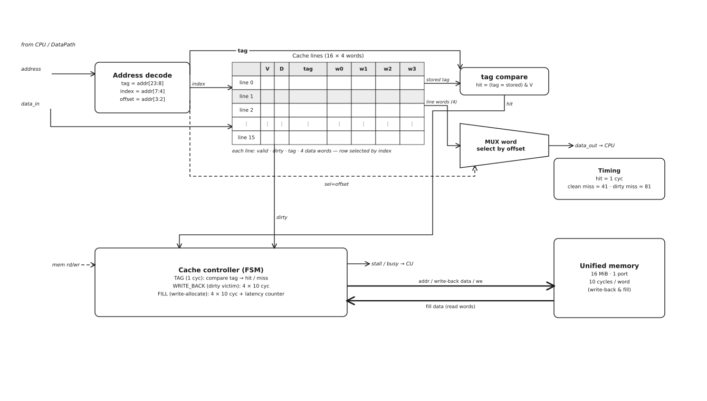

# Лабораторная работа №4. Отчёт

Преподаватель: Пенской Александр Владимирович

Студент: Седов Даниил Борисович

Группа: P3216

Вариант:

```text
asm | risc | neum | hw | tick | binary | trap | port | pstr | prob2 | cache
```

## Содержание

- [1. Вариант и линия проектирования](#1-вариант-и-линия-проектирования)
- [2. Язык программирования](#2-язык-программирования)
- [3. Организация памяти](#3-организация-памяти)
- [4. Система команд](#4-система-команд)
- [5. Транслятор](#5-транслятор)
- [6. Модель процессора](#6-модель-процессора)
- [7. Соглашение о вызовах и стандартные процедуры](#7-соглашение-о-вызовах-и-стандартные-процедуры)
- [8. Тестирование](#8-тестирование)

## 1. Вариант и линия проектирования

Вариант задаёт систему сразу на всей цепочке, поэтому каждое решение либо прямо следует из пункта варианта, либо поддерживает уже принятое решение на соседнем уровне:

```text
asm source -> translator -> binary machine code + readable listing -> tick-accurate model -> trace log + output
```

| Токен    | Следствие для архитектуры                                                                                              |
| -------- | ---------------------------------------------------------------------------------------------------------------------- |
| `asm`    | язык — ассемблер: нет автоматического распределения регистров, spill, скрытых literal pool и runtime-вызовов           |
| `risc`   | регистровый load-store процессор; арифметика только над регистрами; память — `lw`/`sw`; ввод-вывод — `in`/`out`        |
| `neum`   | единая байтово-адресуемая однопортовая память: код, данные, строки, векторы, стек в одном адресном пространстве        |
| `hw`     | hardwired Control Unit; `PC`, счётчик шага и регистры прерываний хранятся в нём                                        |
| `tick`   | модель продвигается ровно на один такт за шаг; всё состояние наблюдаемо на каждом такте, в том числе внутри инструкции |
| `binary` | настоящий бинарный файл (контейнер сегментов) + человекочитаемый листинг                                               |
| `trap`   | ввод через прерывания по расписанию; обработчик — на разрабатываемом asm; у устройства один регистр данных             |
| `port`   | port-mapped ввод-вывод: отдельное адресное пространство портов и инструкции `in`/`out`                                 |
| `pstr`   | строки с префиксом длины (Pascal string); строковые операции — процедуры/макросы на asm                                |
| `prob2`  | алгоритм варианта — Euler problem 6 (см. раздел [8.2](#82-алгоритмы-и-golden-тесты))                                   |
| `cache`  | все обращения к памяти идут через единый кеш между процессором и памятью; ожидание при промахе видно в журнале         |

Итоговая система — **32-битный RISC load-store процессор фон-неймановского типа** с байтовой адресацией, однопортовой памятью, единым direct-mapped write-back кешем, hardwired Control Unit, потактовой моделью, port-mapped вводом-выводом и trap-вводом через программный обработчик прерывания.

## 2. Язык программирования

### 2.1. Назначение языка

Так как вариант задаёт `asm`, язык описывает машинную программу почти напрямую: каждая строка либо кодируется в одну машинную инструкцию, либо является псевдоинструкцией, явно раскрываемой ассемблером. Язык поддерживает метки, секции, директиву `.org`, пользовательские макросы, константы и условную компиляцию.

Язык намеренно **не** поддерживает автоматическое распределение регистров, автоматический spill в память, скрытый literal pool, линковку нескольких объектных файлов, систему типов высокого уровня и неявные runtime-вызовы. Это важно для проверяемости: отчёт должен показывать отображение программы на память и процессор, а если бы транслятор сам принимал решения о регистрах и размещении данных, связь между исходным текстом и аппаратной моделью стала бы менее прозрачной.

### 2.2. Лексика

Комментарии начинаются с `;` и идут до конца строки. Идентификаторы чувствительны к регистру (`Loop` и `loop` различны).

```ebnf
identifier ::= letter { letter | digit | "_" }
```

Локальная метка макроса начинается с `%%` и существует только внутри одного раскрытия макроса. Целочисленные литералы:

```asm
123          ; decimal
0x7b         ; hexadecimal
0b01111011   ; binary
'a'          ; character literal, value 97
'\n'         ; escaped character
'\x7f'       ; byte escape
```

Символьный литерал имеет значение `0..255`, так как `pstr` хранит символ как байтовый код в одном 32-битном слове. Строковые литералы используются только в директивах данных (прежде всего `.pstr`); неэкранированный символ должен быть ASCII, произвольный байт задаётся через `\xNN`.

### 2.3. Синтаксис

```ebnf
program        ::= { line }
line           ::= [ label_def ] [ statement ] [ comment ] newline
label_def      ::= identifier ":"

statement      ::= instruction | directive | macro_call
instruction    ::= mnemonic [ operand_list ]
operand_list   ::= operand { "," operand }
operand        ::= register | expression | memory_operand | identifier
memory_operand ::= expression "(" register ")"

directive          ::= section_directive | org_directive | data_directive
                     | const_directive | macro_directive | conditional_directive
section_directive  ::= ".section" ( ".vectors" | ".text" | ".rodata" | ".data" | ".bss" )
org_directive      ::= ".org" expression
data_directive     ::= ".word" expression { "," expression } | ".space" expression | ".pstr" string
const_directive    ::= ".equ" identifier "," expression
macro_directive    ::= ".macro" identifier [ identifier { "," identifier } ] newline { line } ".endm"
conditional_directive ::= ".if" expression newline { line } [ ".else" newline { line } ] ".endif"
macro_call         ::= identifier [ operand_list ]

expression ::= integer | character | identifier | "(" expression ")"
             | unary_op expression | expression binary_op expression
unary_op   ::= "+" | "-" | "~"
binary_op  ::= "+" | "-" | "*" | "/" | "%" | "<<" | ">>" | "&" | "^" | "|"
```

Деление в выражениях ассемблера целочисленное; деление на ноль в выражении — ошибка трансляции.

### 2.4. Семантика

**Стратегия вычислений.** Программа исполняется строго последовательно по `PC`. Выражения транслятора вычисляются один раз во время ассемблирования (это «время компиляции»), их результат подставляется в поля инструкций или директив. Времени исполнения принадлежат только сами инструкции процессора.

**Области видимости.** Обычные метки и константы глобальны на весь модуль. Единственные локальные имена — метки `%%name` внутри раскрытия макроса: при каждом раскрытии они получают уникальное внутреннее имя.

**Типизация.** Язык бестиповый: значение — это 32-битное слово. Виды литералов — целые (`dec`/`hex`/`bin`), символьные (`'a'`, значение `0..255`) и строковые (только в `.pstr`). Регистр или ячейка трактуются как signed или unsigned самой инструкцией (например, `slt` против `sltu`, `addi` против `andi`).

До первой директивы `.section` текущая секция — `.text`. Метка обозначает байтовый адрес следующего размещаемого объекта в текущей секции и сама памяти не занимает. Константа `.equ` подставляется как значение и в память не размещается. Макросы и псевдоинструкции раскрываются **до** назначения адресов — ассемблер должен видеть окончательный поток инструкций, прежде чем вычислять байтовые адреса меток. Условие `.if` тоже вычисляется до назначения адресов, поэтому может использовать только уже известные константы.

Этого описания достаточно, чтобы исполнить программу «на бумаге»: видны все регистры, секции, адреса, переходы, размещение данных и порядок раскрытия макросов.

### 2.5. Директивы данных и выравнивание

Так как память байтово-адресуемая, `.org` принимает байтовый адрес. Директива `.word expr` размещает 32-битное слово (4 байта); `.space expr` резервирует `expr` байт (в `.bss` — без payload, заполняется нулями загрузчиком); `.pstr "..."` размещает Pascal string как слово длины и по слову на символ. Перед `.word`, `.pstr` и любой инструкцией текущий адрес обязан быть кратен 4 — ассемблер не добавляет скрытого выравнивания, чтобы сохранить явность размещения.

### 2.6. Макросы и псевдоинструкции

Макрос — текстовая подстановка с параметрами. Рекурсивные макросы запрещены, максимальная глубина раскрытия — 32.

```asm
.macro push reg
    addi sp, sp, -4
    sw reg, 0(sp)
.endm

.macro pop reg
    lw reg, 0(sp)
    addi sp, sp, 4
.endm
```

Псевдоинструкции не входят в ISA и раскрываются до первого прохода:

| Псевдоинструкция | Раскрытие                                                |
| ---------------- | -------------------------------------------------------- |
| `move rd, rs`    | `add rd, rs, zero`                                       |
| `ret`            | `jr ra`                                                  |
| `call label`     | `jal label`                                              |
| `li rd, imm32`   | `addi`/`ori` (если влезает в 16 бит) либо `lui` + `ori`  |
| `la rd, label`   | загрузка 24-битного байтового адреса через `lui` и `ori` |

Дальний условный переход в пару инструкций ассемблер **не** разворачивает: если смещение branch не помещается в signed 16-bit, это ошибка трансляции — структуру дальнего перехода выбирает программист.

### 2.7. Стиль программ

Демонстрационные программы написаны в структурном стиле: одна нормальная точка завершения через `halt`; процедуры возвращаются через `ret`, обработчики прерываний — через `iret`; нет нескольких несвязанных `halt`; все буферы, константы и строки именованы; критические секции вокруг общей очереди ввода минимальны. Форматирование исходного asm проверяется тестами.

## 3. Организация памяти

Раздел сквозной: модель памяти едина для транслятора, кеша и процессора.

### 3.1. Слово, байт, порядок байтов, диапазон адресов

Машинное слово — 32 бита (4 байта). Память адресуется байтами, адрес имеет 24 бита:

```text
0x000000 .. 0xFFFFFF   ; 2^24 = 16 MiB, 2^22 выровненных 32-битных слов
```

24 бита выбраны под формат команд: при 32-битной инструкции и 8-битном opcode абсолютный переход занимает оставшиеся 24 бита и покрывает всё адресное пространство. Все слова записываются **big-endian**: `.word 0x12345678` занимает байты `12 34 56 78`. Это удобно для листинга — байты идут в том же порядке, в котором слово печатается восьмизначным hex.

### 3.2. Выравнивание

| Операция                    | Требование                           |
| --------------------------- | ------------------------------------ |
| выборка инструкции          | `PC % 4 == 0` и `PC <= 0xFFFFFC`     |
| `lw` / `sw`                 | `addr % 4 == 0` и `addr <= 0xFFFFFC` |
| `j` / `jal` / `jr` / branch | target кратен 4 и в диапазоне        |
| reset / interrupt vector    | значение кратно 4 и не равно `0`     |

Невыровненный или выходящий за диапазон адрес останавливает модель с `FAULT_ADDR`. Отдельный fault на невыровненность не вводится: для этой архитектуры это частный случай некорректного адреса.

### 3.3. Единая память

Из `neum` следует единая память. В ней находятся таблица векторов, инструкции и процедуры, статические данные, Pascal strings, программные буферы ввода, стек и данные, созданные во время исполнения. Аппаратного разделения памяти команд и данных нет; флаги секций используются загрузчиком, листингом и отладкой, но защиты памяти не создают. В симуляторе память — простой массив байтов, адрес — индекс. Память однопортовая: за такт выполняется либо чтение, либо запись; на уровне кеша это проявляется в том, что нельзя одновременно читать новую линию и записывать вытесняемую.

### 3.4. Карта памяти и секции

Первые 64 байта зарезервированы под таблицу векторов (16 слов).

```text
0x000000 .. 0x000003 : reset vector
0x000004 .. 0x000007 : input interrupt vector
0x000008 .. 0x00003F : reserved vectors (= 0)
0x000040             : default .text start
.rodata              : после .text, выровнено на 4
.data                : после .rodata, выровнено на 4
.bss                 : после .data, выровнено на 4
0xFFFFFF             : последний байт памяти
```

| Секция     | Назначение                                   |
| ---------- | -------------------------------------------- |
| `.vectors` | таблица векторов reset и input interrupt     |
| `.text`    | машинные инструкции и процедуры              |
| `.rodata`  | статические неизменяемые данные и строки     |
| `.data`    | изменяемые статические данные                |
| `.bss`     | нулевые данные без payload в бинарном образе |

Фиксированные начальные адреса имеют только `.vectors` (`0x000000`) и `.text` (`0x000040`). Остальные секции размещаются последовательно с выравниванием начала на 4 байта; нужен конкретный адрес — используется `.org`. Перезапись уже размещённого байта запрещена даже одинаковым значением: один байт образа не может иметь два происхождения.

### 3.5. Таблица векторов

`reset vector` (`0x000000`) содержит байтовый адрес первой инструкции: при сбросе процессор читает слово по адресу `0x000000` через кеш и кладёт его в `PC`. `input interrupt vector` (`0x000004`) содержит адрес обработчика ввода. Значение `0` означает отсутствие обработчика: нулевой reset vector даёт `FAULT_NO_RESET_VECTOR`, нулевой вектор при активном прерывании — `FAULT_NO_IRQ_HANDLER`.

```asm
.section .vectors
.org 0x000000
.word _start
.word irq_input
.space 56            ; оставшиеся 14 слов таблицы
```

### 3.6. Размещение литералов, констант, переменных, стека и строк

- **Литералы.** Непосредственный литерал кодируется внутри инструкции, только если помещается в её поле (`addi a0, zero, 42`). Если нет — программист пишет `li a0, 0x12345678`, которая раскрывается в `lui` + `ori`. Скрытого literal pool нет: все статические данные видны в исходном коде.
- **Константы.** `.equ STACK_INIT, 0x01000000` в память не размещается, подставляется как значение выражения.
- **Переменные.** Статическая переменная размещается явно (`counter: .word 0` в `.data`). На регистр переменная отображается только если программист сам выбрал регистр; при нехватке регистров он сам сохраняет значения на стек или в статическую память — транслятор автоматический spill не делает. Кучи нет; динамические данные — на стеке или в явных буферах (`.space`).
- **Инструкции, процедуры, обработчики.** Инструкции размещаются в `.text` (помечается `EXEC`). Процедура — метка в `.text`, вызываемая через `jal`/`call`. Обработчик прерывания — тоже asm-процедура; отличие в способе входа (выполняет Control Unit по вектору) и выхода (`iret` вместо `ret`).
- **Стек.** Стек — соглашение, а не отдельная память. Растёт вниз; `sp` — байтовый адрес следующего свободного слова. Инициализация `li sp, 0x01000000` (адрес «сразу за вершиной»): значение допустимо как 32-битное, ошибка возникнет только при реальном обращении вне диапазона. Защиты пересечения стека и данных нет (следствие `neum`).
- **Строки.** Pascal string: первое слово — длина, далее по слову на символ.

```text
msg + 0  : 0x00000003   ; length
msg + 4  : 0x00000048   ; 'H'
msg + 8  : 0x00000069   ; 'i'
msg + 12 : 0x0000000A   ; '\n'
```

Статические строки разрешены только в `.rodata` и `.data` (требование `pstr` — строки в секции данных).

## 4. Система команд

### 4.1. Общие свойства

Из `risc` следует: каждая инструкция занимает ровно одно 32-битное слово по адресу, кратному 4; арифметика и логика работают только с регистрами; память — только через `lw`/`sw`; ввод-вывод — только через `in`/`out`. Скрытых флагов `carry`/`zero`/`negative` нет — условные переходы сравнивают регистры напрямую, а 64-битная арифметика реализуется явно через пары слов и `sltu` для вычисления переноса. Все операции, кроме деления, выполняются по модулю `2^32`; деление на ноль даёт `FAULT_DIV0`. Описанных свойств достаточно для классификации: это **RISC**.

### 4.2. Регистры

16 регистров общего назначения по 32 бита. Число 16 удобно: 4-битное поле помещает три регистра в одну команду и оставляет место под opcode и immediate.

|     Номер | Имя      | Назначение                      |
| --------: | -------- | ------------------------------- |
|      `r0` | `zero`   | всегда `0`, запись игнорируется |
|      `r1` | `a0`     | аргумент 0                      |
|      `r2` | `a1`     | аргумент 1                      |
|      `r3` | `a2`     | аргумент 2                      |
|      `r4` | `a3`     | аргумент 3                      |
| `r5..r10` | `t0..t5` | временные регистры              |
|     `r11` | `rv`     | возвращаемое значение           |
|     `r12` | `k0`     | scratch обработчика прерывания  |
|     `r13` | `k1`     | scratch обработчика прерывания  |
|     `r14` | `sp`     | указатель стека                 |
|     `r15` | `ra`     | адрес возврата                  |

Аппаратно особым является только `zero`. Остальные имена — соглашение. `k0`/`k1` выделены из-за `trap`: при входе в обработчик аппаратура сохраняет только `PC`, `IE` и причину, поэтому обработчику нужны рабочие регистры, не используемые основной программой. Побочный эффект инструкции происходит даже при записи в `zero`: `in zero, IN_DATA` прочитает порт и очистит `READY`, отбросив значение, — для port-mapped I/O чтение порта это действие, а не только вычисление.

### 4.3. Виды адресации

| Вид адресации             | Где используется             | Смысл                                |
| ------------------------- | ---------------------------- | ------------------------------------ |
| register                  | ALU-инструкции               | операнд в регистре                   |
| immediate signed 16-bit   | `addi`, `lw`, `sw`, branch   | непосредственное signed-значение     |
| immediate unsigned 16-bit | `andi`, `ori`, `xori`, `lui` | непосредственное unsigned-значение   |
| base + byte offset        | `lw`, `sw`                   | `base + sign_extend(off16)`          |
| PC-relative byte offset   | branch                       | `адрес следующей инструкции + off16` |
| absolute byte address     | `j`, `jal`                   | 24-битный байтовый адрес             |
| port immediate address    | `in`, `out`                  | 16-битный адрес порта                |

### 4.4. Форматы кодирования

Все слова в бинарном файле записываются big-endian. Используется 8-битный opcode: Control Unit выбирает поведение по одному байту, без отдельного поля `funct`. Цена — reserved-биты в R- и Z-форматах; они проверяются декодером и при ненулевом значении дают `FAULT_BAD_ENCODING`, превращая случайный мусор в детектируемую ошибку.

```text
R-format  | opcode[31:24] | rd[23:20] | rs1[19:16] | rs2[15:12] | reserved=0 |
I-format  | opcode[31:24] | rd[23:20] | rs1[19:16] | imm16[15:0]              |
B-format  | opcode[31:24] | rs1[23:20]| rs2[19:16] | off16[15:0]              |
J-format  | opcode[31:24] | addr24[23:0]                                      |
P-format  | opcode[31:24] | reg[23:20]| 0[19:16]   | port16[15:0]             |
Z-format  | opcode[31:24] | reserved=0[23:0]                                  |
```

Для `sw` поле `rd` трактуется как регистр-источник; для `lui` поле `rs1` должно быть `0`; в P-формате поле `reg` — это `rd` для `in` и `rs` для `out`, биты `19..16` должны быть нулём. Примеры реального кодирования (big-endian слово целиком):

```text
000050 - 0x20510000 - lw t0, 0(a0)      ; I: op=20 rd=5(t0) rs1=1(a0) imm=0000
000054 - 0x10610004 - addi t1, a0, 4    ; I: op=10 rd=6(t1) rs1=1(a0) imm=0004
000058 - 0x30500014 - beq t0, zero, 20  ; B: op=30 rs1=5(t0) rs2=0 off16=0014
000060 - 0x51700011 - out 0x0011, t2    ; P: op=51 reg=7(t2) 0 port=0011
000048 - 0x41000050 - jal 0x000050      ; J: op=41 addr24=000050
```

### 4.5. Набор инструкций

Базовые такты указаны для случая, когда выборка и все обращения к памяти попадают в кеш. При промахе соответствующая стадия cache access длится 41 или 81 такт вместо 1 (см. раздел [6.5](#65-кеш)).

| Opcode | Инструкция             | Формат | Такты | Семантика                                        |
| -----: | ---------------------- | ------ | ----: | ------------------------------------------------ |
| `0x00` | `nop`                  | Z      |     2 | нет действия                                     |
| `0x01` | `add rd, rs1, rs2`     | R      |     2 | `rd = rs1 + rs2`                                 |
| `0x02` | `sub rd, rs1, rs2`     | R      |     2 | `rd = rs1 - rs2`                                 |
| `0x03` | `mul rd, rs1, rs2`     | R      |     2 | младшие 32 бита произведения                     |
| `0x04` | `mulhu rd, rs1, rs2`   | R      |     2 | старшие 32 бита unsigned-произведения            |
| `0x05` | `divu rd, rs1, rs2`    | R      |     2 | unsigned-деление                                 |
| `0x06` | `remu rd, rs1, rs2`    | R      |     2 | unsigned-остаток                                 |
| `0x07` | `and rd, rs1, rs2`     | R      |     2 | bitwise and                                      |
| `0x08` | `or rd, rs1, rs2`      | R      |     2 | bitwise or                                       |
| `0x09` | `xor rd, rs1, rs2`     | R      |     2 | bitwise xor                                      |
| `0x0A` | `sll rd, rs1, rs2`     | R      |     2 | `rd = rs1 << (rs2 & 31)`                         |
| `0x0B` | `srl rd, rs1, rs2`     | R      |     2 | logical right shift                              |
| `0x0C` | `sra rd, rs1, rs2`     | R      |     2 | arithmetic right shift                           |
| `0x0D` | `slt rd, rs1, rs2`     | R      |     2 | signed `<` → `0`/`1`                             |
| `0x0E` | `sltu rd, rs1, rs2`    | R      |     2 | unsigned `<` → `0`/`1`                           |
| `0x10` | `addi rd, rs1, imm16`  | I      |     2 | `rd = rs1 + sign_extend(imm16)`                  |
| `0x11` | `andi rd, rs1, imm16`  | I      |     2 | `rd = rs1 & zero_extend(imm16)`                  |
| `0x12` | `ori rd, rs1, imm16`   | I      |     2 | `rd = rs1 \| zero_extend(imm16)`                 |
| `0x13` | `xori rd, rs1, imm16`  | I      |     2 | `rd = rs1 ^ zero_extend(imm16)`                  |
| `0x14` | `lui rd, imm16`        | I      |     2 | `rd = imm16 << 16`                               |
| `0x20` | `lw rd, off16(base)`   | I      |     3 | чтение слова из памяти через кеш                 |
| `0x21` | `sw rs, off16(base)`   | I      |     3 | запись слова в память через кеш                  |
| `0x30` | `beq rs1, rs2, label`  | B      |     2 | переход, если `rs1 == rs2`                       |
| `0x31` | `bne rs1, rs2, label`  | B      |     2 | переход, если `rs1 != rs2`                       |
| `0x32` | `blt rs1, rs2, label`  | B      |     2 | signed `<`                                       |
| `0x33` | `bge rs1, rs2, label`  | B      |     2 | signed `>=`                                      |
| `0x34` | `bltu rs1, rs2, label` | B      |     2 | unsigned `<`                                     |
| `0x35` | `bgeu rs1, rs2, label` | B      |     2 | unsigned `>=`                                    |
| `0x40` | `j label`              | J      |     2 | абсолютный переход                               |
| `0x41` | `jal label`            | J      |     2 | `ra = address_of_jal + 4`, затем `PC = label`    |
| `0x42` | `jr rs`                | R      |     2 | `PC = rs`                                        |
| `0x43` | `halt`                 | Z      |     2 | остановка модели                                 |
| `0x50` | `in rd, port`          | P      |     2 | чтение из порта                                  |
| `0x51` | `out port, rs`         | P      |     2 | запись в порт                                    |
| `0x60` | `ei`                   | Z      |     2 | включить прерывания после завершения инструкции  |
| `0x61` | `di`                   | Z      |     2 | выключить прерывания после завершения инструкции |
| `0x62` | `iret`                 | Z      |     2 | возврат из обработчика                           |

После стадии `IF` регистр `PC` уже указывает на следующую инструкцию, поэтому `jal` записывает в `ra` текущий `PC` (что на уровне ISA равно `address_of_jal + 4`). Для `lw`/`sw` эффективный адрес `(base + sign_extend(off16)) mod 2^32` проверяется как выровненный word-адрес; для branch — `address_of_branch + 4 + sign_extend(off16)`. Нарушение даёт `FAULT_ADDR`.

### 4.6. Чего ISA не делает

ISA не содержит byte load/store (символ `pstr` хранится в слове, алгоритмы работают со словами), системных вызовов (ввод-вывод — порты, обработчик — обычный asm), аппаратных строковых инструкций (запрещено смыслом `pstr`) и скрытых флагов ALU (зависимости видны через регистры — RISC-свойство). Байтовая адресация при этом сохраняется: адреса байтовые, инструкции по 4 байта, смещения `lw`/`sw` в байтах.

### 4.7. Аварийные остановки (faults)

| Причина                 | Когда возникает                                          |
| ----------------------- | -------------------------------------------------------- |
| `HALT`                  | выполнен `halt` (успешное завершение)                    |
| `FAULT_NO_RESET_VECTOR` | reset vector равен `0`                                   |
| `FAULT_NO_IRQ_HANDLER`  | input interrupt vector равен `0` при активном прерывании |
| `FAULT_BAD_OPCODE`      | неизвестный opcode                                       |
| `FAULT_BAD_ENCODING`    | reserved-биты не равны нулю или формат нарушен           |
| `FAULT_ADDR`            | адрес вне диапазона, невыровненный word-доступ или `PC`  |
| `FAULT_BAD_PORT`        | неверный порт или неверное направление доступа           |
| `FAULT_DIV0`            | `divu`/`remu` с делителем `0`                            |
| `STOP_TICK_LIMIT`       | достигнут лимит тактов                                   |

## 5. Транслятор

### 5.1. Интерфейс командной строки транслятора

```bash
asm.py <source.asm> <target.bin> --debug <target.hex> --map <target.map.json>
```

Обязательны `source.asm` (исходная программа) и `target.bin` (бинарный образ). Дополнительно создаются человекочитаемый листинг `target.hex` и source map `target.map.json` для журнала модели.

### 5.2. Этапы трансляции

Ассемблер работает в два прохода после препроцессинга (метка может использоваться до определения):

1. лексический разбор строк;
2. обработка `.equ`, `.macro`, `.if/.else/.endif`;
3. раскрытие макросов и псевдоинструкций;
4. разбор директив и инструкций;
5. **первый проход** — location counter по секциям, применение `.org`, назначение байтовых адресов меткам, обнаружение пересечений байтов, проверка выравнивания;
6. **второй проход** — вычисление выражений, проверка диапазонов, кодирование инструкций, формирование байтовых сегментов;
7. запись `target.bin`, `target.hex`, `target.map.json`.

Псевдоинструкции раскрываются до первого прохода, так как меняют количество машинных слов и, значит, адреса последующих меток. Адреса меток байтовые: для `j`/`jal` в `addr24` пишется адрес метки; для branch вычисляется `off16 = target - (branch_address + 4)`; в `off16(base)` смещение тоже байтовое.

### 5.3. Бинарный формат и загрузка

Из `binary` следует настоящий бинарный файл. Так как `asm` допускает `.org` и разреженное размещение, используется контейнер сегментов (плоский файл был бы огромным или неоднозначным).

```text
Header:  magic "L4MC" (4 b) | version u16 = 1 | segment_count u16
Segment: base_address u32 | byte_count u32 | flags u32 | bytes (если flags.BSS = 0)
```

Флаги сегмента: `EXEC` (бит 0), `WRITE` (бит 1), `BSS` (бит 2, payload отсутствует). Защитой памяти они не являются. Сегменты не могут пересекаться. Загрузчик создаёт `2^24` байт нулей и применяет сегменты по порядку (для `BSS` — заполнение нулями без payload). После загрузки процессор не стартует с фиксированного адреса, а читает reset vector по `0x000000` через кеш — единое правило: даже начальный `PC` берётся из памяти.

### 5.4. Отладочный листинг

Формат строки — `<address> - <HEXCODE> - <mnemonic>`; для слов данных мнемоника заменяется директивой. Фрагмент листинга `hello` (псевдоинструкции уже раскрыты: `la a0, msg` → `lui`+`ori`, `call` → `jal`, `ret` → `jr ra`):

```text
000040 - 0x14100000 - lui a0, 0
000044 - 0x12110074 - ori a0, a0, 116
000048 - 0x41000050 - jal 0x000050
00004C - 0x43000000 - halt
000050 - 0x20510000 - lw t0, 0(a0)
...
000074 - 0x0000000C - .word 12      ; длина строки "hello world\n"
000078 - 0x00000068 - .word 104     ; 'h'
```

### 5.5. Диагностируемые ошибки трансляции

Ассемблер завершает работу с ошибкой при: неизвестной инструкции/директиве/идентификаторе; дублировании метки или константы; делении на ноль в выражении; значении, не помещающемся в поле; невыровненном или слишком далёком branch/jump target; пересечении байтов от `.org`/секций; невыровненном размещении инструкции/`.word`/`.pstr`; `.pstr` вне секции данных; символе вне `0..255`; отрицательном `.space`; глубине раскрытия макроса больше 32; неизвестном для препроцессора значении в `.if`; выходе сегмента за диапазон. Восстановление после ошибки не требуется (учебный, непромышленный характер транслятора).

## 6. Модель процессора

### 6.1. Интерфейс командной строки модели

```bash
machine.py <program.bin> <input.schedule> --map <program.map.json> --log <trace.log> --max-ticks 1000000
```

Вход — бинарный образ и расписание входных событий; выход — символы из `OUT_DATA` в stdout, потактовый журнал и причина остановки.

### 6.2. Потактовая модель

Модель разделена на пассивный **DataPath** и активный **Control Unit**. DataPath не решает, какую инструкцию исполнять и какой `PC` выбрать — он только выполняет управляющие сигналы. Control Unit хранит `PC`, `EPC`, `CAUSE`, `STATUS`, состояние FSM, счётчик шага `step` и декодированную инструкцию. В коде методы DataPath соответствуют сигналам схемы (`latch_ir`, `latch_alu_out`, `write_register`, `cache_read`, `port_write`, `alu_execute` и т.п.), а декодирование opcode — ответственность Control Unit. Это даёт прямое соответствие «сигнал на схеме ↔ метод в модели».

Главный цикл продвигает систему ровно на один такт за вызов:

```text
while not halted and not fault:
    machine.tick()
```

`tick()` не исполняет инструкцию целиком — он делает один переход FSM и один такт работы кеша или портов. Антипаттерн «выполнить всю инструкцию и прибавить N тактов» не используется: при нём состояние наблюдаемо только на границах инструкций. Здесь на **каждом** такте наблюдаемы все регистры, `IR`, `ALU_OUT`, `PC`, `EPC`, `CAUSE`, `STATUS`, состояние кеша, состояние устройства ввода, линия IRQ, текущие `state` и `step`. Если состояние ждёт кеш, `step` растёт каждый такт, а не перескакивает к концу ожидания.

### 6.3. DataPath


DataPath построен на мультиплексорах и защёлках. `PC` в нём отсутствует — он в Control Unit и приходит на DataPath лишь как один из источников адреса кеша.

| Элемент             | Назначение                                                |
| ------------------- | --------------------------------------------------------- |
| `IR`                | защёлкнутое 32-битное слово текущей инструкции            |
| Register File       | 16 регистров; запись через дешифратор (one-hot)           |
| Immediate generator | комбинационно строит sign/zero-extended immediate         |
| `ALU`               | арифметика, логика, сравнения, вычисление адресов         |
| `ALU_OUT`           | промежуточная защёлка результата ALU для доступа к памяти |
| MUX WB              | выбор источника записи в регистр                          |
| MUX ADDR            | выбор адреса кеша: `PC`, vector address или `ALU_OUT`     |
| Cache               | общий кеш инструкций, данных и векторов                   |
| Port I/O            | отдельное адресное пространство портов                    |

Управляющие сигналы DataPath (на схеме показаны пучком от Control Unit, подписи у входов):

| Сигнал      | Действие                                               |
| ----------- | ------------------------------------------------------ |
| `ir_latch`  | защёлкнуть слово из кеша в `IR`                        |
| `reg_we`    | разрешить запись в регистровый файл (через дешифратор) |
| `alu op`    | операция ALU                                           |
| `alu_r sel` | второй операнд ALU: immediate или `rs2`                |
| `ao_latch`  | защёлкнуть результат ALU в `ALU_OUT`                   |
| `addr sel`  | источник адреса кеша: `PC` / vector / `ALU_OUT`        |
| `mem rd/wr` | режим обращения к кешу: чтение или запись              |
| `wb sel`    | источник writeback: `ALU_OUT` / cache / port / `PC`    |
| `io rd/wr`  | чтение или запись порта                                |

`ALU_OUT` нужен для согласованности со схемой: `lw`/`sw` не делают «вычисление адреса + доступ к памяти» как read-modify-write за один такт. Сначала адрес защёлкивается в `ALU_OUT`, затем следующий такт использует его для обращения к кешу — иначе на схеме возникла бы комбинационная петля.

### 6.4. Control Unit


Control Unit — hardwired FSM (памяти микрокода нет, следствие `hw`). Он содержит регистры `PC`, `EPC`, `CAUSE`, `STATUS` и мультиплексор источника `PC`.

| Регистр  | Назначение                   |
| -------- | ---------------------------- |
| `PC`     | счётчик команд               |
| `EPC`    | адрес возврата из прерывания |
| `CAUSE`  | причина прерывания           |
| `STATUS` | биты `IE` и `IN_IRQ`         |

Декодирование комбинационное (отдельного такта `DECODE` нет), поэтому базовая RISC-инструкция при попадании в кеш занимает 2 такта: `IF` (выборка) и `EXEC` (исполнение). Состояния FSM:

```text
RESET_VECTOR -> IF
IF -> EXEC_ALU | EXEC_ADDR | EXEC_BRANCH | EXEC_JUMP | EXEC_IO | EXEC_SYS
EXEC_ADDR -> MEM
* -> AFTER_INSTR -> (IRQ_ENTER | IF)
IRQ_ENTER -> IRQ_VECTOR -> IF
EXEC_SYS -> HALTED   (для halt)
любое некорректное условие -> FAULT
```

`AFTER_INSTR` — не отдельный такт, а логическая точка в конце такта исполнения: в ней проверяется возможность входа в прерывание и выбирается следующее состояние. `step` равен `0` на входе в обычное состояние и растёт каждый такт в состояниях ожидания кеша. Управляющие линии Control Unit к DataPath, кешу и портам рисуются пучком (`reg_we`, `ir_latch`, `alu_r sel`, `alu op`, `ao_latch`, `addr sel`, `mem rd/wr`, `io rd/wr`, `wb sel`), а не полной разводкой — иначе схема превращается в мешанину линий.

### 6.5. Кеш



Память фон-неймановская и однопортовая, поэтому кеш один и общий: через него идут чтение reset vector, выборка инструкций, `lw`/`sw` и чтение векторов прерываний. Порты не кешируются (вариант `port`).

```text
организация    : direct-mapped
line size      : 4 words = 16 bytes
line count     : 16 (capacity 64 words = 256 bytes)
hit latency    : 1 такт
memory latency : 10 тактов на доступ к слову
write policy   : write-back
miss policy    : write-allocate
```

Разбиение адреса: `word_offset = (addr/4) % 4`, `index = (addr/16) % 16`, `tag = addr/256`. Каждая линия хранит `valid`, `dirty`, `tag` и 4 слова данных. Такты доступа:

| Случай     | Такты | Состав                                        |
| ---------- | ----: | --------------------------------------------- |
| hit        |     1 | проверка tag                                  |
| clean miss |    41 | 1 (tag) + 4×10 (загрузка линии)               |
| dirty miss |    81 | 1 (tag) + 4×10 (write-back) + 4×10 (загрузка) |

Во время промаха Control Unit остаётся в текущем cache-access состоянии. Ожидание **не** сжимается в одну операцию: каждый такт проверки, write-back и fill — отдельный вызов `tick()` и отдельная строка журнала; clean miss даёт 41 строку, dirty miss — 81. Так промах виден в журнале, а входные события, пришедшие во время ожидания, проверяемы. Размер линии в 4 слова делает видимой пространственную локальность (после промаха на первом слове три следующих читаются с hit), а 16 линий позволяют демонстрировать конфликтные промахи адресами с шагом 256 байт. Так как кеш единый, проблемы когерентности кода и данных нет; самомодифицирующийся код разрешён как следствие `neum`, но в тестах не обязателен.

### 6.6. Ввод-вывод и прерывания

Из `trap` следует, что символ становится доступен не по факту чтения, а потому что устройство получило токен по расписанию и подняло прерывание. «Запрос прерывания» и «чтение `IN_DATA`» — разные события (их запрещено смешивать). Так как вариант `port`, ввод-вывод не отображается в память; порт имеет 16-битный адрес:

| Порт     | Имя          | Доступ | Назначение                         |
| -------- | ------------ | ------ | ---------------------------------- |
| `0x0000` | `IN_STATUS`  | read   | `READY`(0), `EOF`(1), `OVERRUN`(2) |
| `0x0001` | `IN_DATA`    | read   | текущий входной символ             |
| `0x0002` | `IN_CTRL`    | write  | очистка `EOF`(0) и `OVERRUN`(1)    |
| `0x0010` | `OUT_STATUS` | read   | всегда `1` (устройство готово)     |
| `0x0011` | `OUT_DATA`   | write  | вывод одного символа (`rs & 0xFF`) |

Неверный порт или направление доступа дают `FAULT_BAD_PORT`. Запись в `OUT_DATA` добавляет символ в выходной буфер, который показывается по окончании моделирования.

**Расписание входа** — список событий `такт символ` (номера тактов строго возрастают; после `EOF` событий нет; двух событий в один такт нет). Событие применяется в начале указанного такта.

**Устройство ввода** имеет один `data_register` и флаги `READY`/`EOF`/`OVERRUN`. Аппаратной очереди нет: если символ приходит при `READY = 0`, он попадает в регистр, выставляет `READY` и поднимает IRQ; если при `READY = 1` — теряется, выставляется `OVERRUN` (старый символ сохраняется). IRQ level-triggered и активна, пока `READY`, `EOF` или `OVERRUN` равны 1.

**Вход в прерывание** проверяется каждый такт, но выполняется только на границе инструкции (precise interrupts) при `IE = 1`, `IN_IRQ = 0`, `IRQ = 1`:

```text
EPC = PC; CAUSE = INPUT; IE = 0; IN_IRQ = 1
PC = memory[0x000004] через кеш
```

После reset `IE = 0`/`IN_IRQ = 0`, чтобы программа успела инициализировать стек и буферы до первого обработчика. Вложенные прерывания запрещены; `iret` восстанавливает `PC = EPC`, `IE = 1`, `IN_IRQ = 0`. Если линия IRQ всё ещё активна, процессор снова войдёт в обработчик до выборки следующей инструкции основной программы — прерывание подтверждается действиями программы, а не самим входом.

**Программная очередь.** Аппаратной очереди нет, но для `cat` (потенциально бесконечный ввод) программа держит кольцевой буфер в памяти: обработчик ввода быстро читает `IN_DATA` и кладёт символ в `rx_buf`, а основная программа извлекает его через короткие критические секции `di … ei` (обработчик и основной код меняют одни и те же слова). Если буфер полон — выставляется `ring_overflow`; если устройство потеряло символ — `device_overrun`. Так теряются данные при слишком быстром вводе, без «магических очередей».

### 6.7. Разбор инструкций по тактам

По схемам любую инструкцию можно разобрать по тактам. Ниже — характерные случаи (при cache hit); такт `IF` одинаков для всех: `addr sel = PC` → кеш отдаёт слово → `ir_latch` защёлкивает его в `IR`, параллельно `PC ← PC + 4`.

- **`add rd, rs1, rs2` (2 такта).** `IF`; затем `EXEC_ALU`: регистры `rs1`, `rs2` идут на входы `ALU` (`alu_r sel` = `rs2`), `alu op` = add, результат через `MUX WB` (`wb sel` = ALU) и `reg_we` записывается в `rd`.
- **`lw rd, off16(base)` (3 такта при hit).** `IF`; `EXEC_ADDR`: `ALU` складывает `base` и `sign_extend(off16)` (`alu_r sel` = imm), `ao_latch` защёлкивает адрес в `ALU_OUT`; `MEM`: `addr sel` = `ALU_OUT`, `mem rd/wr` = read, слово из кеша через `MUX WB` (`wb sel` = cache) пишется в `rd`. При промахе стадия `MEM` длится не 1, а 41/81 такт: Control Unit остаётся в `MEM`, `step` растёт каждый такт, в журнале видно `cache=MISS … phase=FILL`.
- **`beq rs1, rs2, label` (2 такта).** `IF`; `EXEC_BRANCH`: `ALU`/компаратор проверяет `rs1 == rs2`; если равно, Control Unit выбирает `pc_src` = branch target (`PC` нового адреса), иначе `PC` остаётся `PC + 4`.
- **`out port, rs` (2 такта).** `IF`; `EXEC_IO`: `io rd/wr` = write, значение `rs` уходит в `Port I/O` по адресу `port`; символ добавляется в выходной буфер.
- **Вход в прерывание (2 такта при hit).** `IRQ_ENTER`: `EPC ← PC`, `CAUSE ← INPUT`, `IE ← 0`, `IN_IRQ ← 1`; `IRQ_VECTOR`: `addr sel` = vector address (`0x000004`), кеш отдаёт адрес обработчика, `pc_src` = vector → `PC`.

### 6.8. Журнал и причины остановки

Каждый такт пишется в журнал отдельной строкой: `T` (такт), `step`, `mode` (`RESET`/`MAIN`/`IRQ`/`HALTED`/`FAULT`), `state`, `pc`, `ir`, `alu_out`, `addr_sel`, `decoded`, `epc`, `cause`, `status` (`IE`/`IN_IRQ`), `irq`, `in_status`, `out_len`, `stop`, полный `regs[…]`, исходная строка `src` и событие кеша/порта. Реальные строки журнала `hello`:

```text
T=000041 step=0 mode=MAIN state=IF pc=000040 ir=0x00000000 ... src='la a0, msg' cache=read:tag:addr=000040:index=04:tag=000000:MISS
T=000218 step=0 mode=MAIN state=EXEC_IO pc=000064 ir=0x51700011 ... out_len=1 src='out OUT_DATA, t2' port=out 0x0011 <- 0x00000068
T=000493 step=0 mode=MAIN state=EXEC_SYS pc=000050 ir=0x43000000 ... out_len=12 stop=HALT src='halt'
```

Журнал не сжимает такты ожидания кеша в одну запись: промах на 41 такт даёт 41 строку (иначе скрывается состояние регистров внутри инструкции и нельзя проверить входные события). Из поля `mode` однозначно видно, исполняется основная программа или обработчик (требование `trap`). По журналу видно и то, что символ не может появиться в выводе раньше физически возможного такта: сначала событие входа делает порт готовым, затем процессор на границе инструкции входит в обработчик, обработчик кладёт символ в буфер, и лишь потом основная программа извлекает его и выполняет `out`. Причины остановки перечислены в разделе [4.7](#47-аварийные-остановки-faults). После `HALT` модель не обязана сбрасывать dirty-линии: наблюдаемый результат — это вывод через `OUT_DATA` и журнал.

## 7. Соглашение о вызовах и стандартные процедуры

Вызов — `jal`/`call` (адрес возврата в `ra`), возврат — `jr ra`/`ret`. Аргументы передаются в `a0..a3`, результат — в `rv`. Регистры, которые процедура должна сохранить, она сохраняет на стек макросами `push`/`pop` (вложенные вызовы сохраняют `ra`). Обработчик прерывания использует только `k0`/`k1` без сохранения, а остальные затрагиваемые регистры кладёт на стек и возвращается через `iret`.

На этом соглашении построены стандартные процедуры на asm, общие для демонстраций: `puts_pstr` (печать Pascal string посимвольно через `OUT_DATA`), `read_line_pstr` (чтение строки из программной очереди ввода до `\n`/`EOF` с контролем overrun), `print_u64` (печать 64-битного беззнакового числа), `rx_pop` (извлечение символа из кольцевого буфера под `di/ei`) и `irq_input` (обработчик ввода). Строковые операции реализованы именно процедурами, а не аппаратным строковым типом (требование `pstr`).

## 8. Тестирование

### 8.1. Состав тестов

Тестирование двухуровневое. Юнит-тесты (`src/tests/`) покрывают отдельные элементы: ISA (кодирование/декодирование), ассемблер, DataPath, Control Unit, кеш, отдельные компоненты исполнения и сценарии модели. Интеграционные тесты оформлены как **golden-тесты** (`src/golden/`, плагин `pytest-golden`): один тест — один самодостаточный YAML-файл, в котором собрано всё нужное для проверки в одном месте:

- `in_source` — исходная программа;
- `in_args` / расписание ввода;
- `out_code_base64` — бинарный машинный код;
- `out_listing` — человекочитаемый листинг (`адрес — hex — мнемоника`);
- `out_stdout` — вывод программы;
- `out_log` — репрезентативный фрагмент журнала (при большом объёме обрезается до достаточного для проверки потактовой работы, кеша, прерываний и портов);
- `out_ticks`, `out_stop_reason`.

### 8.2. Алгоритмы и golden-тесты

Обязательные демонстрационные программы (исходники — `src/examples/`, эталоны — `src/golden/`):

| Алгоритм          | Демонстрирует                                 | Golden                                                                                                                           |
| ----------------- | --------------------------------------------- | -------------------------------------------------------------------------------------------------------------------------------- |
| `hello`           | печать статической Pascal string              | [hello.yml](src/golden/hello.yml)                                                                                                |
| `cat`             | эхо ввода через прерывания (бесконечный ввод) | [cat.yml](src/golden/cat.yml)                                                                                                    |
| `hello_user_name` | приглашение, чтение имени, приветствие        | [hello_user_name.yml](src/golden/hello_user_name.yml)                                                                            |
| `sort`            | загрузка списка чисел, сортировка, вывод      | [sort.yml](src/golden/sort.yml)                                                                                                  |
| двойная точность  | 64-битная арифметика при 32-битном слове      | [double_precision.yml](src/golden/double_precision.yml)                                                                          |
| `prob2`           | алгоритм варианта                             | [prob2_range.yml](src/golden/prob2_range.yml) и др.                                                                              |
| кеш               | влияние кеша на производительность            | [cache_sequential.yml](src/golden/cache_sequential.yml), [cache_conflict_writeback.yml](src/golden/cache_conflict_writeback.yml) |

Отдельно проверяются граничные и ошибочные случаи: невыровненный `lw` (`FAULT_ADDR`), плохое кодирование (`FAULT_BAD_ENCODING`), невыровненный `.org`, byte-offset branch, тайминг прерываний (`trap_irq`), потактовость `lw` (`tick_lw`), пустой/нулевой/максимальный/вне-диапазона входы `prob2`.

**Алгоритм варианта `prob2` — Euler problem 6:** разность квадрата суммы и суммы квадратов первых `n` чисел, `(Σ k)² − Σ k²`. Сумма считается как `n(n+1)/2`, сумма квадратов — `n(n+1)(2n+1)/6`, итог — в 64 битах (через `mul`/`mulhu` и вычитание с заёмом через `sltu`), что одновременно демонстрирует двойную точность. Вход подаётся через ввод (десятичное число), результат — на вывод; на некорректный или вне-диапазона вход возвращается ошибка ввода/диапазона.

### 8.3. Непрерывная интеграция

При отправке в `main` CI прогоняет проверку форматирования `ruff`, линтер `ruff`, типизатор `mypy`, юнит- и golden-тесты `pytest`, а также `markdownlint` для документации. Настройки строгие; локальных отключений правил `ruff` нет. Локально тот же набор проверок запускается единой целью:

```bash
make        # format-check + lint + typecheck + test + markdownlint
```

### 8.4. Пример работы инструментальной цепочки

Полный проход от исходника до журнала:

```bash
# 1. трансляция: asm -> бинарь + листинг + source map
python src/asm.py src/examples/hello.asm hello.bin --debug hello.hex --map hello.map.json

# 2. запуск модели: бинарь + расписание ввода -> вывод + журнал
: > hello.input
python src/machine.py hello.bin hello.input --map hello.map.json --log hello.log
```

Результат `hello`: на stdout — `hello world`, остановка `HALT` за `498` тактов (первые такты — clean miss на reset vector и на выборке инструкций, что наглядно показывает работу кеша). Соответствующие листинг и фрагмент журнала приведены в разделах [5.4](#54-отладочный-листинг) и [6.8](#68-журнал-и-причины-остановки) и зафиксированы в [hello.yml](src/golden/hello.yml).
