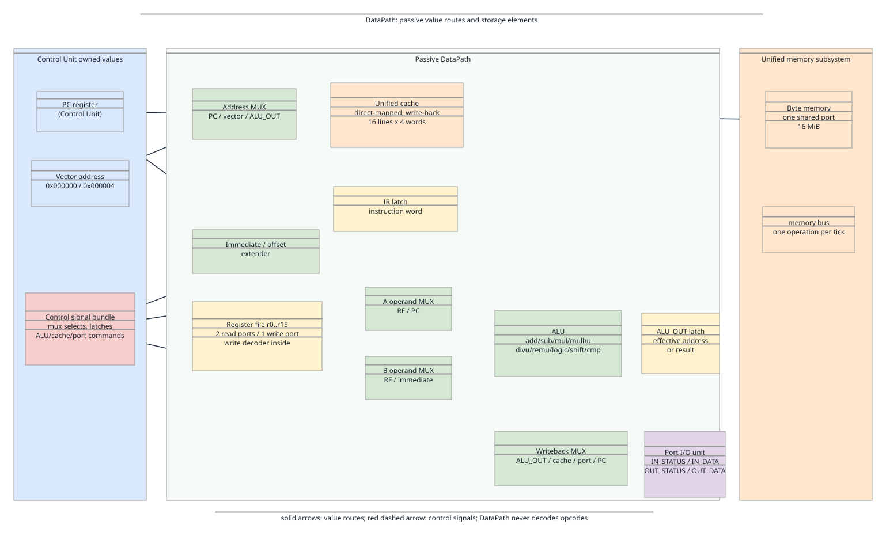
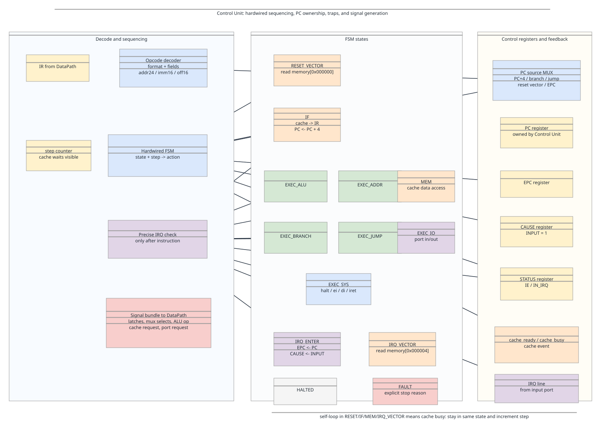

# Schemes

The submitted schemes are intentionally split:

- [`datapath.drawio`](datapath.drawio) shows where values can flow: register file,
  operand muxes, ALU, `ALU_OUT`, writeback mux, unified cache, unified memory,
  and ports.
- [`control_unit.drawio`](control_unit.drawio) shows why a signal bundle is selected
  on each tick: opcode decoder, hardwired FSM, `step`, `PC`, `EPC`, `CAUSE`,
  `STATUS`, cache-ready feedback, and precise interrupt entry.

SVG previews are committed for quick review:





The split keeps data movement separate from control decisions. A combined CPU
diagram would hide the thing the defense normally checks: DataPath has possible
routes, while Control Unit chooses one route per tick.

## Element Base

The diagrams use:

- multiplexers;
- latches and registers;
- a register file with one write decoder;
- ALU as one functional block;
- unified direct-mapped cache;
- unified byte memory with one port;
- port I/O block.

The diagrams do not use demultiplexers, standalone logic gates, detailed adder
or multiplier internals, duplicated memory address inputs, or separate
instruction/data memories. The ALU is intentionally not expanded below the
architecture level: the model treats arithmetic, shifts, comparisons,
multiplication, and division as one execute tick.

## Signal Mapping

DataPath methods are named as hardware-level signals:

```text
latch_ir(value)
latch_alu_out(value)
write_register(reg, value)
read_register(reg)
select_address_source(src)
cache_read(address)
cache_write(address, value)
port_read(port)
port_write(port, value)
alu_execute(op, lhs, rhs)
```

DataPath does not decode `addi`, `jal`, `iret`, or any other instruction. It
only executes these signal-level operations. Opcode decoding and sequencing live
in `control_unit.py`.

## Instruction Walkthroughs

All instructions start with the same fetch route:

```text
PC -> Cache address MUX -> unified cache -> IR
PC <- PC + 4
```

`lw a0, 0(sp)`:

```text
IF          PC -> cache read -> IR, PC <- PC + 4
EXEC_ADDR   RF[sp] + sign_extend(0) -> ALU_OUT
MEM         ALU_OUT -> cache read -> RF[a0]
AFTER       check pending IRQ
```

`jal foo`:

```text
IF          PC -> cache read -> IR, PC <- PC + 4
EXEC_JUMP   RF[ra] <- PC, PC <- addr24(foo)
AFTER       check pending IRQ
```

After `IF`, `PC` already contains the return address. That is why `jal` writes
the current `PC` into `ra`.

`iret`:

```text
IF          PC -> cache read -> IR, PC <- PC + 4
EXEC_SYS    PC <- EPC, STATUS.IE <- 1, STATUS.IN_IRQ <- 0
AFTER       if IRQ is still active, enter IRQ again
```

For cache misses, `IF`, `MEM`, `RESET_VECTOR`, or `IRQ_VECTOR` remains the
current state until the cache operation completes. A clean miss is 41 separate
ticks; a dirty miss is 81 separate ticks. The implementation never replaces that
sequence with a single log line or a direct `ticks += 41`/`ticks += 81`.

## Check Method

The implementation follows this verification route:

1. Read the DataPath scheme to list possible value routes.
2. Read the Control Unit scheme to derive `state`, `step`, and signal bundles.
3. Walk each instruction class manually through `IF` plus its execute state.
4. Check that `datapath.py` exposes only signal-level methods.
5. Check that `control_unit.py` owns opcode sequencing, `PC`, interrupts, and
   stop reasons.
6. Compare traces from golden tests with the manual walkthroughs.
7. Confirm cache waits are visible tick by tick, including the state, step,
   registers, IRQ line, and input events during the wait.
